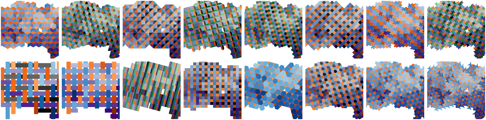

# WeavingSpace QGIS

Mapping several attributes of the same areas in a single map remains a challenge. Tiled and woven maps can help. Small repeating patterns of shapes are laid across the study area and each kind of shape is coloured by a different attribute. Project page:
[foldingspace.github.io/weavingspaceQGIS](https://foldingspace.github.io/weavingspaceQGIS/).


*Four indices of deprivation in a basket weave, and seven in a
7-colouring of hexagons, both over the centre of Auckland. Each legend
names which element carries which variable. Figure 1 from O'Sullivan
and Bergmann (2026).*

## An experimental prototype

This is experimental research software and should be treated as such.

This QGIS plugin is an interface to the [weavingspace](https://github.com/DOSull/weavingspace) library by David
O'Sullivan and Luke Bergmann. By contrast, the QGIS interface here was mostly
co-written by Luke Bergmann and large language models (Claude Fable and
Opus, working through Claude Code). The plugin echoes and extends our earlier (also handwritten)
[web-based interface](https://geospatialstuff.com/mapweaver/app/).
You should expect rough edges, and we would rather hear about them than
not.

## Installing

You do not need a GitHub account, git, or a command line for any of
this.

1. Go to the
   [latest release](https://github.com/FoldingSpace/weavingspaceQGIS/releases/latest)
   and download the file named `weavingspace_qgis.zip`. It will be
   under a heading called *Assets*; save it somewhere you can find it
   again, such as your Downloads folder.
2. In QGIS, choose **Plugins ▸ Manage and Install Plugins… ▸ Install
   from ZIP**, click the **…** button to pick the file you just
   downloaded, and click **Install Plugin**. QGIS may warn you that the
   plugin is experimental, which it is.
3. Open the dialog from the toolbar button, or from **Plugins ▸
   WeavingSpace**.

To update later, download the new zip and install it the same way over
the top.

QGIS 4.x is required.


## What it makes

The
plugin produces ordinary QGIS layers: one per pattern element,
gathered in a layer group, each with their own symbolization developed by you. Results are then editable in QGIS. You can refine symbology in the Layer Styling
panel, export to GeoPackage with the styles embedded, and place the
result in a print layout.


*Six moments in time in one map: anthropogenic biomes across the
northeast of North America, after Ellis et al. (2021). Figure 2 from
O'Sullivan and Bergmann (2026).*

The grid at the top of this page is sixteen designs over one place:
the same Auckland deprivation data with the same variable in the same
colour throughout — deprivation blue, employment brown, income purple
— and only the pattern changing, so the families can be compared with
each other rather than admired one at a time.

The plugin draws the same kinds of map from your own layers:

<p align="center">
  
  
</p>

Tilings and weaves are both available, from the same catalogue the
technique's authors work with, along with grids and stripes, geometric
modifiers (rotation, insets, scaling, skew), per-element colour ramps
and opacity, and the option to draw the pattern as glyphs rather than
as a tiling.

## Using it

Load a polygon layer in a projected CRS, rough in a design with coarse
spacing, assign variables and colours, refine, and only then tighten
the spacing. Large tiles compute quickly, the preview and the live map
follow your changes, and nothing about an early spacing choice is
binding. Categorical elements get an "Edit colours" button, which sets
a colour per value when a ramp will not do. The dialog's Help tab
carries condensed guidance and every control has a tooltip;
[docs/USER-GUIDE.md](docs/USER-GUIDE.md) is the fuller treatment, and
the article below is fuller still.

## Further reading

> O'Sullivan, D., & Bergmann, L. (2026). Using MapWeaver to make tiled
> and woven maps of multivariate thematic data. *Cartographic
> Perspectives*, 108, 41–52. https://doi.org/10.14714/CP108.2109
>
> O'Sullivan, D., & Bergmann, L. Tilings and weaves for multivariate
> mapping. Manuscript under review.

The library and its examples are at
[github.com/DOSull/weavingspace](https://github.com/DOSull/weavingspace).
If you would like to make maps like these outside QGIS, MapWeaver is a
browser-based tool built on the same library:
[dosull.github.io/mapweaver/app](https://dosull.github.io/mapweaver/app/).

## Licence and citation

MIT, for both the plugin and the bundled library where we have the rights to license as such; see
[LICENSE.md](LICENSE.md) for both notices. The two figures above are
reproduced from the *Cartographic Perspectives* article by its authors,
who retain copyright in them; they are not covered by this
repository's MIT licence and are not offered for reuse here. If the plugin contributes to
work you publish, please cite the articles above and we'd love to hear from you. Thanks!

## For maintainers

[MAINTAINING.md](MAINTAINING.md) holds the architecture map, the
invariants, and the playbook for when a new QGIS release
breaks something; the version-sensitive API calls are gathered in
`weavingspace_qgis/compat.py` for exactly that occasion. AI assistants
should read [CLAUDE.md](CLAUDE.md) first, which is also a
record of how this project is actually worked on. The test suite in
[tests/](tests/) is self-contained and runs under QGIS's own Python:

```bash
bash tests/run_tests_macos.sh
```

How the tests are held to account, including a mutation-testing
campaign and the commitments that keep its score from becoming a
vanity metric, is described in
[docs/MUTATION-TESTING.md](docs/MUTATION-TESTING.md). Releases go
through `release.py`, which gates on the suite and writes a per-test
report. The vendored library in `weavingspace_qgis/vendor/` is upstream
v0.0.7.61 (commit c0f109c), patched only to make matplotlib and scipy
optional. The tiling catalogue in `catalog.py` mirrors the library's,
and `build.py` produces the installable zip.

We welcome your examples, questions, and reports of anything that
surprises you.
