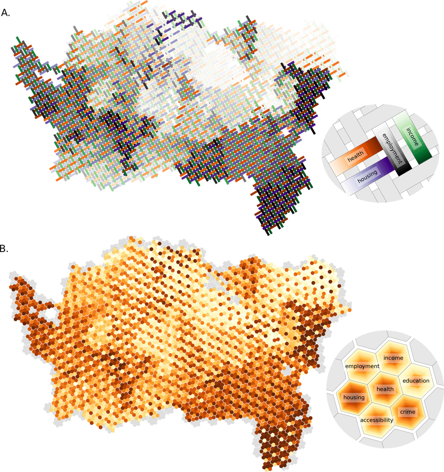
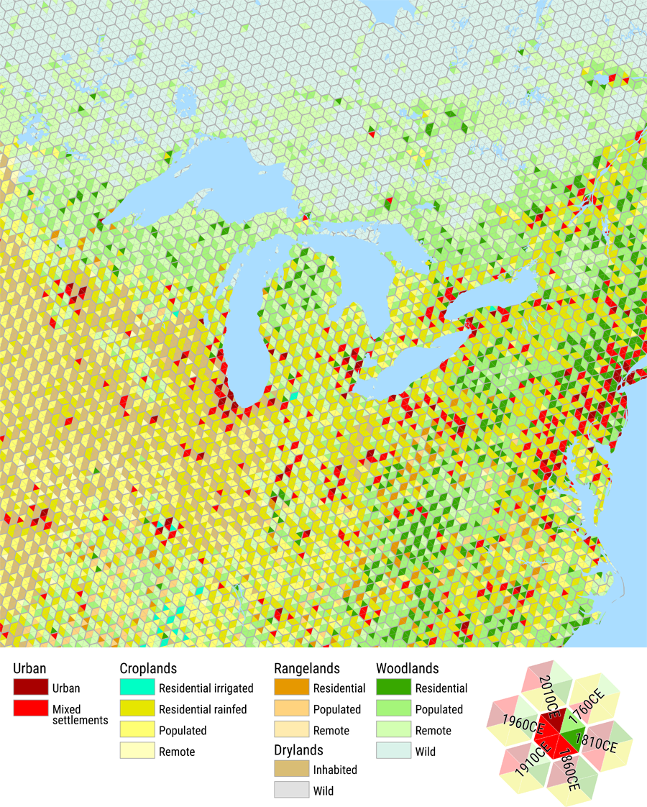
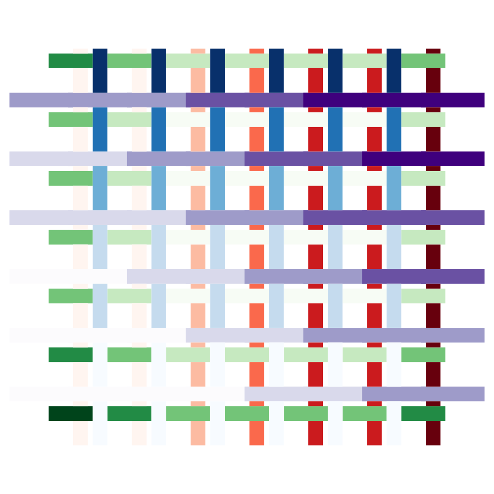
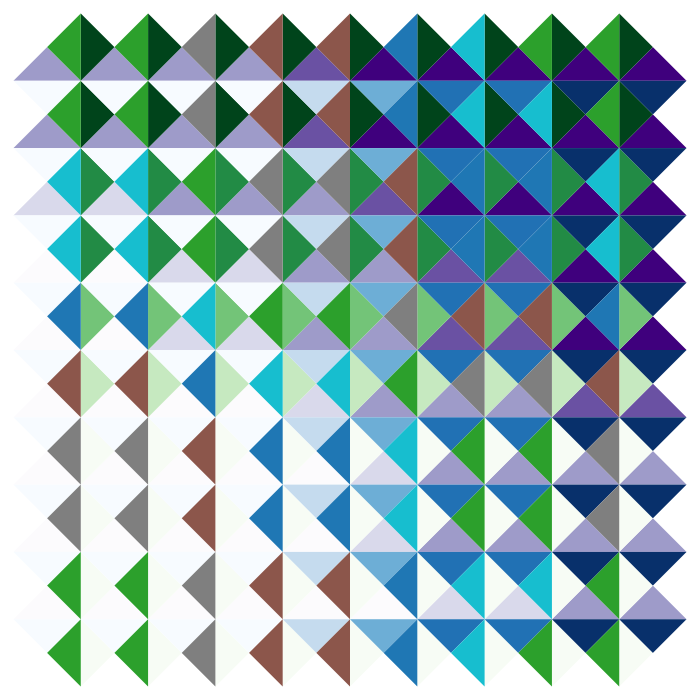
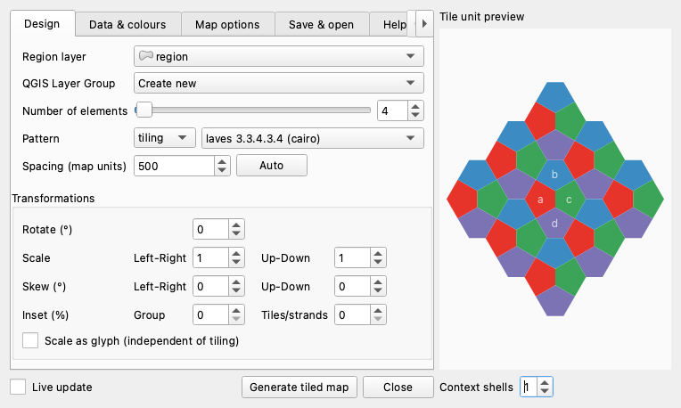

# WeavingSpace QGIS plugin

Mapping several attributes of the same areas in a single map remains an
awkward problem, and this plugin takes one particular approach to it:
tiled and woven maps, in which a small repeating pattern of shapes is
laid across the study area and each kind of shape is coloured by a
different attribute. Project page:
[foldingspace.github.io/weavingspaceQGIS](https://foldingspace.github.io/weavingspaceQGIS/).



*Four indices of deprivation in a basket weave, and seven in a
7-colouring of hexagons, both over the centre of Auckland. Each legend
names which element carries which variable. Figure 1 from O'Sullivan
and Bergmann (2026), reproduced by the authors.*

## An experimental prototype

This is research software and should be treated as such. It was mostly
co-written by Luke Bergmann and large language models (Claude Fable and
Opus, working through Claude Code), which is unusual enough to say
plainly rather than bury: the design decisions, the cartographic
judgements, and the review are Bergmann's, while a great deal of the
code, the tests, and the documentation were drafted by machine and then
read, corrected, and argued with. We have tried to compensate for the
obvious hazards of that arrangement with an unusually heavy test suite
(every map-producing test compares its output against the library
called directly, pixel by pixel in a perceptual colourspace), but you
should expect rough edges, and we would rather hear about them than
not. This applies to the prose as much as to the code: the text you are
reading, the project page, the user guide, and the plugin's own help
and tooltips all contain LLM-generated writing, drafted to our voice
and then edited by us. The publications cited below do not, and are
our own writing throughout. The mathematics and cartography are not
ours to get wrong in any case: they belong to the
[weavingspace](https://github.com/DOSull/weavingspace) library by David
O'Sullivan and Luke Bergmann, which the plugin bundles and calls.

## What it makes

Where a finished image would be the end of the story elsewhere, the
plugin produces ordinary QGIS layers: one per pattern element,
gathered in a layer group, each seeded with a standard graduated or
categorized renderer. Everything after generation is normal QGIS work,
which is the point. You can refine symbology in the Layer Styling
panel, export to GeoPackage with the styles embedded, and place the
result in a print layout, and the plugin will not fight you for
control of any of it.



*Six moments in time in one map: anthropogenic biomes across the
northeast of North America, after Ellis et al. (2021). Figure 2 from
O'Sullivan and Bergmann (2026), reproduced by the authors.*

The plugin draws the same kinds of map from your own layers:

<p align="center">
  
  
</p>

Tilings and weaves are both available, from the same catalogue the
technique's authors work with, along with grids and stripes, geometric
modifiers (rotation, insets, scaling, skew), per-element colour ramps
and opacity, and the option to draw the pattern as glyphs rather than
as a tiling.

## Installing

You do not need a GitHub account, git, or a command line for any of
this.

1. Go to the
   [latest release](https://github.com/FoldingSpace/weavingspaceQGIS/releases/latest)
   and download the file named `weavingspace_qgis.zip`. It will be
   under a heading called *Assets*; save it somewhere you can find it
   again, such as your Downloads folder.
2. In QGIS, choose **Plugins ▸ Manage and Install Plugins… ▸ Install
   from ZIP**, click the **…** button to pick the file you just
   downloaded, and click **Install Plugin**. QGIS may warn you that the
   plugin is experimental, which it is.
3. Open the dialog from the toolbar button, or from **Plugins ▸
   WeavingSpace**.

To update later, download the new zip and install it the same way over
the top.

QGIS 4 or later is required. The plugin needs geopandas, pandas,
shapely, pyproj, and networkx, all of which the QGIS 4 packages for
Windows and macOS already include. Where they are missing or too old
(notably on Linux, where QGIS uses the distribution's Python), the
plugin will offer you a one-time download of the right wheels from
PyPI into its own folder, touching nothing else in the QGIS
installation. Decline it and the plugin will simply not run.



## Using it

Load a polygon layer in a projected CRS, rough in a design with coarse
spacing, assign variables and colours, refine, and only then tighten
the spacing. Large tiles compute quickly, the preview and the live map
follow your changes, and nothing about an early spacing choice is
binding. The dialog's Help tab carries condensed guidance and every
control has a tooltip; [docs/USER-GUIDE.md](docs/USER-GUIDE.md) is the
fuller treatment, and the article below is fuller still.

## Further reading

> O'Sullivan, D., & Bergmann, L. (2026). Using MapWeaver to make tiled
> and woven maps of multivariate thematic data. *Cartographic
> Perspectives*, 108, 41–52. https://doi.org/10.14714/CP108.2109
>
> O'Sullivan, D., & Bergmann, L. Tilings and weaves for multivariate
> mapping. Manuscript under review.

The library and its examples are at
[github.com/DOSull/weavingspace](https://github.com/DOSull/weavingspace).
If you would like to make maps like these outside QGIS, MapWeaver is a
browser-based tool built on the same library:
[dosull.github.io/mapweaver/app](https://dosull.github.io/mapweaver/app/).

## Licence and citation

MIT, for both the plugin and the bundled library; see
[LICENSE.md](LICENSE.md) for both notices. The two figures above are
reproduced from the *Cartographic Perspectives* article by its authors,
who retain copyright in them; they are not covered by this
repository's MIT licence and are not offered for reuse here. If the plugin contributes to
work you publish, please cite the article above; `CITATION.cff` carries
the machine-readable form.

## For maintainers

[MAINTAINING.md](MAINTAINING.md) holds the architecture map, the
invariants (one of which, concerning threads and PROJ, is load-bearing
in the plainest sense), and the playbook for when a new QGIS release
breaks something; the version-sensitive API calls are gathered in
`weavingspace_qgis/compat.py` for exactly that occasion. AI assistants
should read [CLAUDE.md](CLAUDE.md) first, which is also the honest
record of how this project is actually worked on. The test suite in
[tests/](tests/) is self-contained and runs under QGIS's own Python:

```bash
bash tests/run_tests_macos.sh
```

How the tests are held to account, including a mutation-testing
campaign and the commitments that keep its score from becoming a
vanity metric, is described in
[docs/MUTATION-TESTING.md](docs/MUTATION-TESTING.md). Releases go
through `release.py`, which gates on the suite and writes a per-test
report. The vendored library in `weavingspace_qgis/vendor/` is upstream
v0.0.7.61 (commit 80e1dab), patched only to make matplotlib and scipy
optional. The tiling catalogue in `catalog.py` mirrors the library's,
and `build.py` produces the installable zip.

We welcome your examples, questions, and reports of anything that
surprises you.
