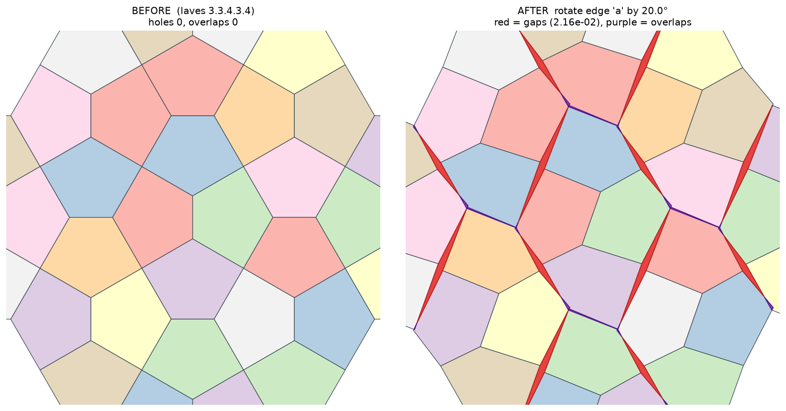
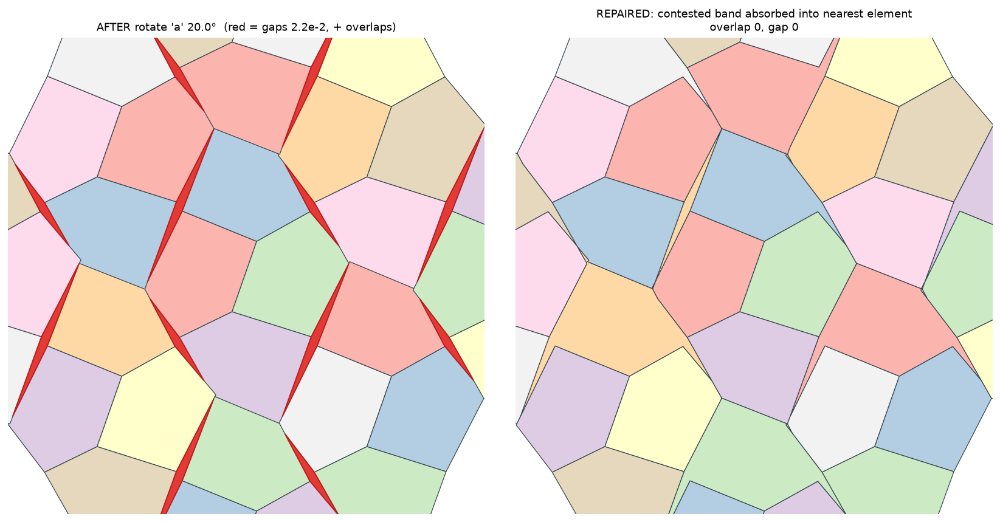
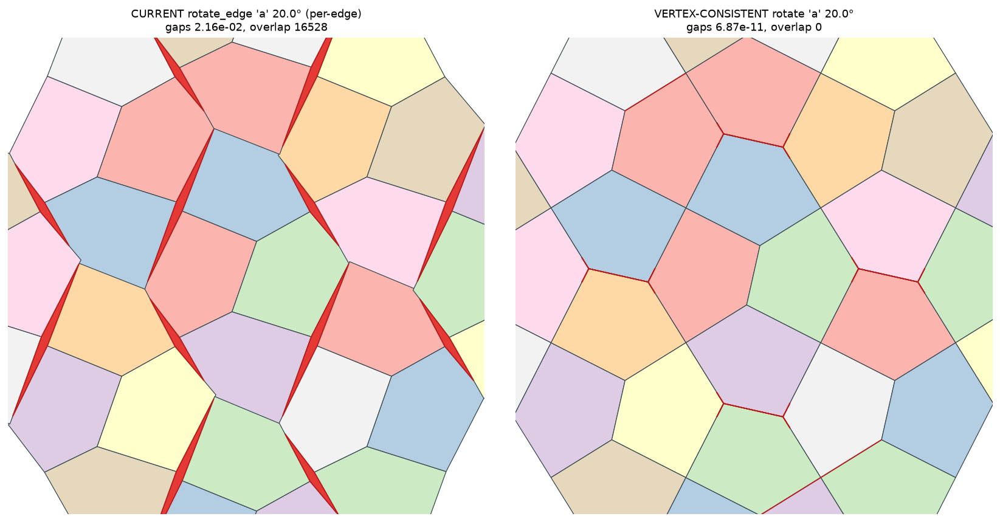
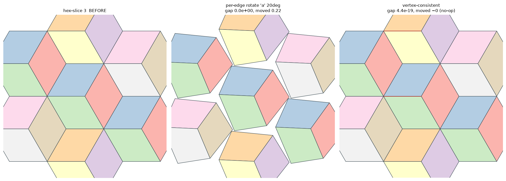

# Rotating and scaling an edge without tearing the tiling

The Topology tab lets somebody take an edge class of the repeating unit
and turn it or stretch it. Both manipulations, as the vendored library
performs them, leave the tiling with gaps. This note is the record of
why that happens, of what we considered, and of the reformulation we
settled on; it is written for whoever revisits the decision, since the
approach may yet change. docs/TOPOLOGY.md points here rather than
carrying the argument itself.

The short version is that the gaps are not a necessity of rotating an
edge. They follow from the particular way the library moves one, and a
formulation that moves the shared vertices instead of the edges keeps
the tiling intact wherever a rotation is possible at all.

## What a plain rotate does

The library's `rotate_edge` takes an edge's two endpoint vertices,
rotates that straight segment about its own midpoint, and writes the new
positions back onto the vertices; `scale_edge` does the same with a
scale about the midpoint. `transform_geometry` applies the chosen one to
every edge of the selected class in turn.

Figure 1 rotates edge class `a` of the default design, `laves
3.3.4.3.4`, by twenty degrees. The tiling comes apart. The red slivers
lie along the rotated edges and the purple lenses sit at the vertices
where two of those edges swing across one another; measured, the gaps
come to 2.2% of the ground and the overlaps to about 0.19%. A rotate of
`archimedean 4.8.8` behaves the same way, and so does a scale of either.

## Why it tears, and whether it must

A tiling vertex is a single point where three or more edges meet, and in
these designs a vertex is often the meeting of two edges of the same
class. When the class is rotated, each of those two edges is turned
about a different midpoint, and each then asks that the one shared vertex
sit in a different place. A point cannot be in two places, so the fan of
edges around it no longer closes: the images pull apart into a gap on one
side and cross into an overlap on the other. That is the whole of the
tear, and it is why a plain rotate reports itself as no longer carrying a
topology.

Is the gap a conceptual necessity of rotating an edge, or an artefact of
this construction? Mostly the second, with one genuinely unavoidable
corner. You cannot rigidly change the angle of a single straight shared
edge while leaving every neighbour straight and fixed; the endpoints are
shared, so something adjacent must move. That much is forced. But the
tear itself is not forced, because the endpoints are allowed to move, and
if a shared vertex is moved once and every edge meeting there follows it,
the tiling stays edge-to-edge. The library reaches the tear only because
it moves each edge independently and lets the last one to touch a shared
vertex win, so lattice-equivalent vertices drift out of register and the
copies of the unit no longer meet. The manner in which the move is
applied, rather than the idea of the move, is what opens the gap.

## What we considered

Three routes were on the table, and it is worth setting them beside one
another, since the differences are as instructive as the verdict.

| Approach | Tiles cleanly? | Moves the design? | Respects symmetry? | Notes |
|---|---|---|---|---|
| Per-edge (the library's own) | no, on every design tried | yes, everywhere | no | the status quo; the tear is the defect |
| Per-edge then absorb the slivers | yes, by reshaping | yes, everywhere | no | fabricates a partition; the tie-break is arbitrary |
| Vertex-consistent | yes, by construction | where a gap-free move exists | yes | a no-op where symmetry forbids a move |

The absorption route (Figure 4) keeps the library's per-edge move, then
gives every gap sliver to the neighbour it shares the most boundary with
and takes every overlap away from one of its two claimants. It always
produces a clean partition, and it always moves the design. Yet the
tiles it produces are no longer the library's tiles; a few gain a sliver
by a rule that has to break near-ties, and the choice of which element
absorbs a sliver is a cartographic decision made by a heuristic rather
than by the person. We kept it in reserve and then set it down, for the
reason the next section gives.

## The reformulation we adopted

The vertex-consistent rotate computes, for each vertex orbit the selected
edges touch, a single displacement from the unmoved positions (the
average of what each incident edge's rotation asks of it), and applies
that one vector to every lattice copy of the orbit. This is exactly the
shape in which the library already applies `push_vertex`: one
displacement per orbit, translation-invariant, so every copy moves
identically and the edited unit still tiles with its own translates. A
vertex moves once; every edge that meets there follows it; the tiling
stays edge-to-edge. `scale_edge` shares the same machinery, its
per-vertex displacement being the scale's rather than the rotation's.

Figure 3 sets the two rotations side by side. The vertex-consistent one
tilts the same edges and leaves a valid tiling, at a gap of about 7e-11
rather than 2.2%. It does cost something: where two edges pull a shared
vertex two ways, the vertex takes their average, so a shared edge is not
turned by exactly the angle asked. The effective rotation is the
symmetry-consistent one rather than the rigid one, and that is the
point, since the rigid one is the torn one.

## The measurement that changed our minds

We nearly rejected the reformulation over one design. On `hex-slice 3`
the vertex-consistent rotate moves nothing at all, while the per-edge
rotate appeared to move it and to leave no gap. Read that way, the
reformulation looked like a regression rather than a repair.

Figure 2 shows what was really happening. The per-edge rotate on
`hex-slice 3` did not stay clean; the units pulled apart, leaving wide
gaps between them. Our gap measure had called it sound because it looks
for holes fully enclosed by tiles, and a gap that opens onto the
surrounding space is not an enclosed hole (the same blind spot the
measure's own documentation already names for an inset's open slots).
The metric, not the method, was wrong.

Asked instead of the real oracle, whether a `Topology` will build on the
result, the picture is unambiguous. Across `laves 3.3.4.3.4`,
`archimedean 4.8.8` and both `hex-slice` designs, for rotate and scale
alike, the per-edge result builds no topology on any of them; the
vertex-consistent result builds on all of them. So the alternatives do
not multiply, they collapse: the vertex-consistent move produces a valid
tiling everywhere, and the per-edge move produces one nowhere. Where the
reformulation moves nothing, it is refusing to draw a broken tiling, not
declining to draw a good one.

That blind spot mattered on its own account, beyond this feature. The
same measure marks each recorded edit as sound or not, and draws the
validity hatch, so a per-edge tear that pulled the units apart would have
been marked sound wherever it was still reachable. We added a
coverage-based check, `plane_coverage`, which lays a patch two rings
deep, takes one fundamental cell well inside it, and asks how much of
that known area the tiles actually cover and how much they cover twice. A
gap-free tiling covers any interior cell entirely, whatever the shape of
a tear; a gap that opens onto the surrounding space leaves the cell short
exactly as an enclosed hole does. The soundness mark and the hatch both
read it now.

## Where it moves nothing, and why that is right

On `hex-slice 3` and `hex-slice 4` the vertex-consistent rotate and scale
leave the design untouched. A lattice-periodic displacement cannot move
the two ends of an edge whose endpoints share an orbit in opposite
directions, and where the design's symmetry demands exactly that, the
orbit's one displacement can only be zero. This is the same obstruction
that already makes `push_vertex` move nothing at a symmetric vertex,
where its gate greys the control and says why.

So the honest answer, on such a design, is that this edge class cannot be
turned or stretched while its tiles still meet, and the tab now says so
in the design's own terms rather than reporting a bare "changed nothing".
The per-edge version's apparent movement there was never a rotation of a
tiling; it was a torn thing that happened to look like one.

## What ships, and what is still open

Both reformulations go into the experimental Topology tab as a candidate
for testing, alongside the coverage-based validity check and the
symmetry-aware message. They may be reverted or reshaped after use; this
note exists so that the reasoning survives either way.

Two questions remain genuinely open. The reformulation lives in the
plugin's own `topology_edits` module rather than in the vendored library,
which keeps the library exactly as upstream ships it and makes the change
easy to withdraw; whether it should instead become a vendored patch,
offered upstream in the manner of the performance patches, is a decision
for a later conversation. And the coverage-based check draws only one
cell's worth of missing ground, which is enough to mark an edit and to
hint at a tear but not yet a full picture of one; a manipulation that
tears while still drawing (a zigzag on an unwilling design) would deserve
the fuller hatch before the honest preview leans on it.
