# The topology of a weave, and what its holes have to do with it

The Topology tab refuses every weave in the catalogue, which is more
than half of it. This note is the record of why, of the constructions we
tried, and of where the answer turned out to lie. It is written for
whoever picks the question up next, and it is organised roughly as the
investigation went rather than as a tidy result, because the wrong
turnings are most of what it has to teach.

The short version is in six parts. A thin weave can be given a structure
by treating the daylight between its strands as tiles, and that works,
but the structure so obtained belongs to the weave and to our cutting of
the holes together, and no amount of care about the cutting recovers the
one thing a weave is about. The second part is that this was the wrong
place to look: the rendered design is a projection, and the
over-and-under is exactly what a projection discards. The third is that
the two halves can be joined after all, which we had thought was the
open problem and which turns out to be measurable: every drawn piece can
be attributed to the strand it belongs to, and the classes the geometry
then falls into are the same partition the code gives, at every strand
width tried. The fourth takes the three ways a weave's ground can be
empty, which are not the same kind of thing as each other, and says what
an edit on a weave would have to preserve to be the analogue of an edit
on a tiling. The fifth is the record of building both readings, and of
the two corrections the maintainer made to the design while it was being
built. The sixth says where all of that leaves us.

Every figure and every number below names the probe that produced it,
and each was re-run against the code as it stands rather than quoted
from an earlier session.

## What a weave is made of, and why that matters here

A weave in this library is not a tiling that has been thinned. Its
strands are generated from a grid: the code `ab-|cd` says which elements
ride in which of two directions, a hyphen marking a strand deliberately
left out, and the `aspect` gives each strand's width as a fraction of
the spacing between them. At an aspect of 1.0 the strands meet and the
plane is covered; below it they do not, and the design has holes by
construction rather than by accident. That construction is why several
obvious repairs fail, and it is worth being clear about before any of
them is described. A strand piece at a low aspect is not a solid one
shrunk: it is narrower across its axis and *longer* along it, which is
what keeps a ribbon continuous where it passes under another, so nothing
that uniformly shrinks a solid weave reproduces a thin one.

## What "the topology of a tiling" is here, stated carefully

The word does a good deal of work in this project, and it is worth
saying plainly what the library actually computes, because the weave
question cannot be posed precisely until we have. It is not a topology
in the mathematical sense. It is three things together: an 'incidence
structure', which tiles meet along which edges and which edges meet at
which vertices; a group, the symmetries of the periodic design, acting
on that structure; and the *orbits* of edges and vertices under that
action, which is what the library calls classes and what an edit is
aimed at.

The third is the one that matters for editing, and it is the reason a
tiling edit is safe rather than merely conventional. Moving a whole edge
class at once moves both sides of every edge in it, so the tiles still
fit; and because the class is an orbit, the result carries the symmetry
the class was derived from. The operation is thus defined on the
structure rather than on any particular edge, and it preserves the
property the structure was built on. So the question to put to a weave
is not "what is its topology" but what plays each of those three parts,
and the three answers need not come from the same place, which is most
of what the rest of this note turns out to be about.

## Why the tab refuses one

`Topology` requires a gap-free tiling. Its constructor lays a patch of
repeats, matches the corners of one tile against its neighbours, and
derives the orbits an edit is later aimed at. A design that does not
cover the plane has no such structure to derive, and the constructor
says so. A weave below aspect 1.0 therefore arrives already refused, and
the refusal is correct.

# Part one: constructions on the rendered design

## What we tried first

| Approach | Gap-free? | Same weave? | Notes |
|---|---|---|---|
| Build at aspect 1.0 | yes | no | the library fuses same-label pieces, and a twill's sixteen tiles become two |
| Build at aspect 0.999 | no | nearly | a millionth of a cell of gap still refuses; the constructor is not asking about size |
| Inset a solid weave | yes, but wrong | no | an inset shortens where thinning lengthens, about 40% wrong on a plain weave |
| Treat the holes as tiles | yes | yes | the strands are untouched, and the daylight becomes tiles beside them |

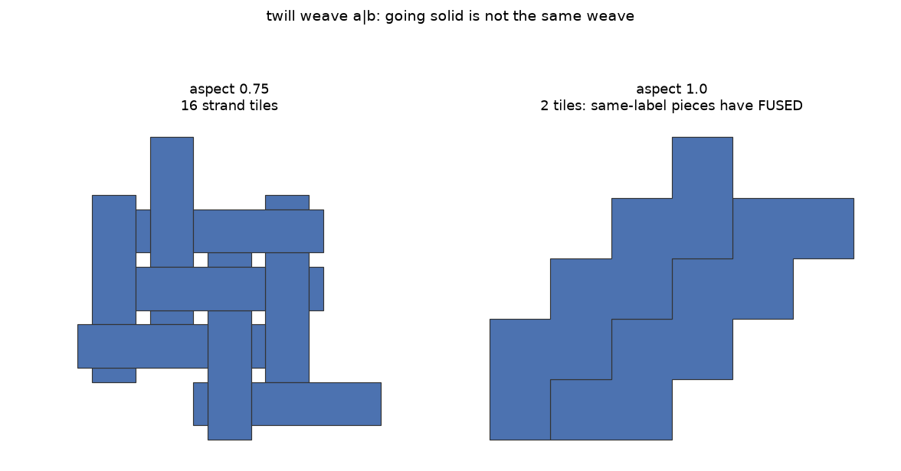

The first row is worth dwelling on, because it looks like the obvious
answer and because the reason it fails runs deeper than the tile count.
Going solid does produce a tiling, but not of the same design: at an
aspect of 1.0 the assembly dissolves adjacent pieces that share a label,
so the sixteen strand tiles of `twill weave a|b` become two. Yet the
tile count is the smaller half of the objection. The tiles of a solid
weave are the *visible portions* of strands, and deciding which portion
is visible is precisely the act that consumes the over-and-under; a
solid weave is therefore a tiling of fragments whose correspondence back
to strands has already been spent. It is not that the design has changed
a little. The object a structure ought to be about is no longer in the
picture at all, which is a thing to notice early, since the same
difficulty comes back in a subtler form four sections below.

The fourth row is the one we followed, and its virtue is negative: it
leaves the strands untouched, which is the property the other three give
up. The daylight is turned into polygons and handed to the constructor
beside the strands, so the design covers the plane and `Topology` will
take it. On `plain weave a|b` at any of four aspects the four strand
tiles plus nine filler tiles give a gap and an overlap of zero, ten edge
classes and seven vertex classes, and the edit round trip closes
(`tools/probes/the_topology_of_a_thin_weave.py`). This is what the
plugin does today, and as engineering it works: sixty-five weaves of
seventy-seven come back through it.

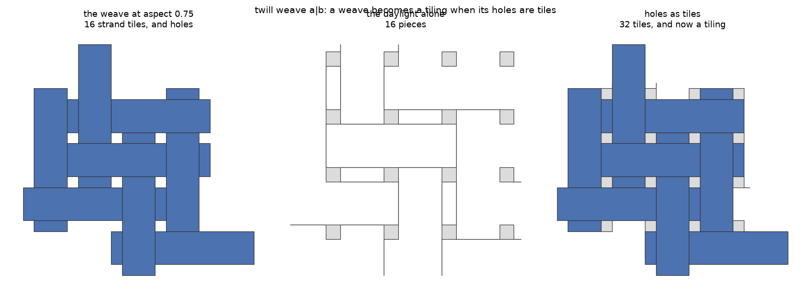

## Whose structure is it

The difficulty is there from the beginning, and it is not a defect in
the construction so much as a fact about what any such construction can
be asked. The classes that come back describe the weave *and our cutting
of the holes* together, and nothing in the result says which of the two
any given class is about. The first sign of it is that they do not
always hold still. The plain weave's ten edge classes and seven vertex
classes are the same at all four aspects, which is reassuring; the
twill's are six and four at aspects 0.9, 0.75 and 0.5, and at 0.25 they
are a hundred and twenty-two and eighty-one, because its daylight falls
into twenty-five pieces there rather than sixteen
(`tools/probes/the_topology_of_a_thin_weave.py`). Nothing about the
weave changed. What changed was the strand width, and with it the shape
of the ground left over, so at least some of what those classes count is
that ground.

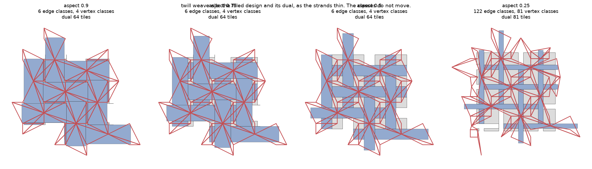

## The control that settles it

That movement is suggestive rather than conclusive, since a sceptic
could fairly say the design at aspect 0.25 is a different design. Yet
the question can be settled outright, by holding the design perfectly
still and changing only the cutting, and the ground here obliges: it can
be cut two ways without a single strand moving.

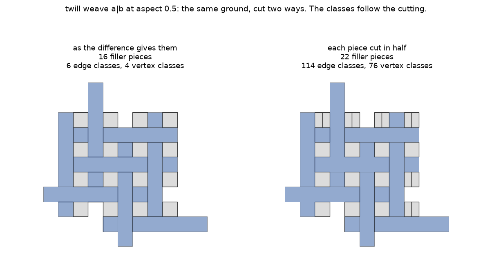

Taking the pieces as the boolean difference happens to return them gives
sixteen filler tiles, six edge classes and four vertex classes; cutting
each of those pieces in half gives twenty-two tiles, a hundred and
fourteen edge classes and seventy-six vertex classes. The strands have
not moved and the ground covered is identical
(`tools/probes/the_topology_of_a_thin_weave.py`). The filling decides
the classes, then, and the classes are not the weave's. What follows
from that is less obvious than it looks, and we spent some time
resisting it: no amount of care about how the holes are cut changes what
kind of thing the answer is.

## Holes made of several kinds of tile

Care about the cutting is nonetheless the obvious next move, and it is
worth making, because the arbitrariness can be removed even if the
dependence cannot. A hole in a thin weave is not one thing: where a
strand has been dropped, the band it would have occupied and the
ordinary aspect gaps flanking it are different in kind and merely happen
to touch. Two canonical cuts are available, and neither has any freedom
in it. The strands code names the band a dropped strand left, so that
cut comes from the specification rather than from the geometry; and the
daylight a strand's width opened divides by whose width opened it, which
is a nearest-site partition with every strand grown at the same rate
(`tools/probes/holes_made_of_typed_tiles.py`).

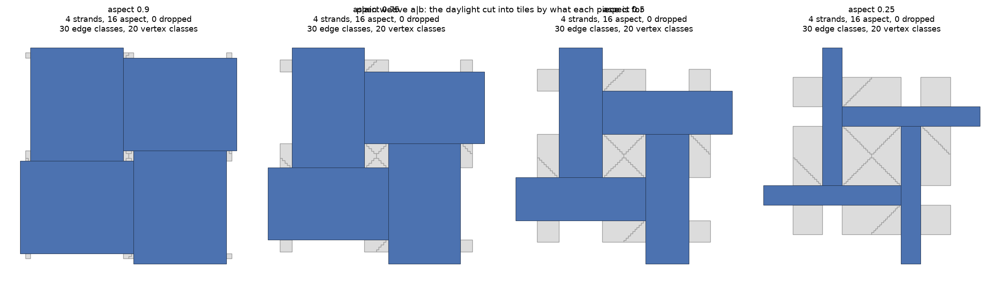

The cut buys the invariance it was written for. On `plain weave a|b` the
typed tiling gives thirty edge classes and twenty vertex classes at all
four aspects, with a gap and an overlap of zero; on `twill weave a|b`, a
hundred and ninety-five and a hundred and thirty, steady from aspect 0.9
to 0.5 and refusing at 0.25; on `twill weave a|b-`, a hundred and
forty-seven and ninety-eight, and on `plain weave ab-|cd-`, three
hundred and thirty-six and two hundred and twenty-four.

It is worth saying that the last two of those refused outright until the
day this note was written, and that we recorded the refusal as a fact
about weaves with dropped strands before looking into it. The two kinds
of daylight were being measured in different frames. `daylight_by_kind`
took the width daylight from `plane_coverage`, which measures one
fundamental cell, and the conscious gap from a difference of tile
geometry, which overhangs the cell because a weave's strand pieces are
longer along their axis than the cell is. The two then summed to 0.246
of a cell against a gap of 0.055, so filling both handed the constructor
a design overlapping its own translates. Every pairwise intersection
inside the unit was zero, which is what said the fault was the frame
rather than the cutting: the pieces are disjoint where they lie and
double-covered once tiled. Clipping the conscious region to the design's
own gap makes the two partition it exactly, on five weaves at four
aspects each, and the refusals go with it (C-351).

TWO THINGS ARE WORTH TAKING FROM THAT beyond the repair. A function
returning two halves of one quantity has to measure both over the same
ground, and nothing here was red, because no product code called it yet.
And a refusal our own code composes reads exactly like a finding, which
this project has now paid for twice in one investigation.

## What to do with the kinds

Once every hole tile carries its kind, an edge of the resulting
structure can be asked what it lies between: two strands, a strand and
its own daylight, or a strand and a dropped strand's band. Two uses
suggested themselves and both were built. The first contracts across the
incidental daylight and refuses to contract across a hyphen, which is
the maintainer's own framing of what a weave's structure ought to ignore
(`tools/probes/a_weave_topology_that_ignores_its_gaps.py`).

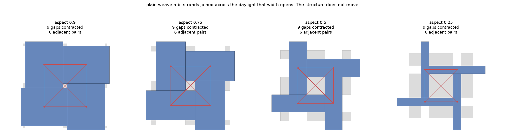

It gives an aspect-invariant answer, which is what it was for: `plain
weave a|b` comes back as four strands with six adjacent pairs and every
degree three, at all four aspects, and `twill weave a|b` as sixteen
strands with thirty-five pairs, likewise unmoved even at 0.25 where the
daylight falls into twenty-five components rather than sixteen. Yet the
distinction the construction exists to draw does not bite. Run twice
over each hyphen weave, once respecting the hyphen and once joining
across every gap alike, it returns the same graph both ways: on `twill
weave a|b-` eight strands and thirteen pairs either way, on `plain weave
ab-|cd-` sixteen and thirty-one, and the count of pairs the hyphen
withholds is zero in both. The strands a dropped strand separates are,
on these weaves, not adjacent for other reasons anyway, so a rule
written to refuse them refuses nothing.

The second absorbs the incidental daylight into the strand it replaces,
so the filler disappears rather than being contracted over
(`tools/probes/absorbing_the_incidental_gaps.py`).

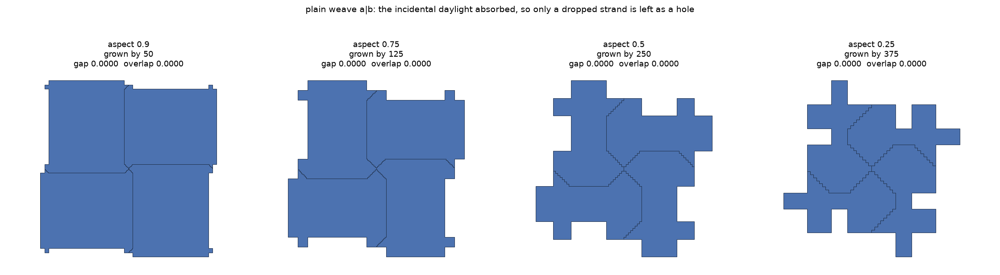

It gives the smallest structure of anything in this part, eleven edge
classes and seven vertex classes on `plain weave a|b`, steady at every
aspect. It also survives on one weave of the four tried
(`tools/probes/does_a_weave_topology_stay_small.py`), for which see the
comparison two sections below.

## Attributing the daylight to what it replaces

Ownership needs a rule for whose daylight a piece is, and proximity is
the wrong one: at a crossing the ground was opened by two strands
retreating from it and belongs to neither more than the other, and a
nearest-strand rule additionally divides a hole along its diagonals, so
each piece faces one strand and meets the others only at points. The
canonical rule asks instead what each piece *replaces*, which strand
would have covered that ground had the yarn been drawn at full width. It
is computed the way `daylight_by_kind` computes a conscious gap, by
building a second weave and comparing, and the reference is the same
weave at an aspect just below 1.0, since at 1.0 the assembly fuses
pieces that share a label and there would be nothing left to attribute
to.

Measured on three weaves at four aspects
(`tools/probes/what_the_daylight_replaces.py`), it attributes every
piece at aspects 0.9, 0.75 and 0.5, leaves two pieces of a twill and one
of `twill weave a|b-` unattributed at 0.25, and the absorbed regions
partition the ground at an overlap of zero throughout. The relation
kinds it yields are the same at every aspect: `a` alongside `a` and `b`
alongside `b`, `a` crossing `b`. Two questions are settled by it.

A pair of strands running alongside one another stays adjacent, which
was in doubt: at full width they would abut along a line, so they are
neighbours, and the worry was that carving each crossing hole among
perpendicular pairs would leave them sharing nothing. It does not. And
the diagonal is refused without a rule written to refuse it, which is
the more satisfying of the two: two absorbed regions at opposite corners
of a hole meet at a point, adjacency here requires a shared segment
rather than a shared point, and no such pair is therefore ever joined.
Where those two strands genuinely cross somewhere else, that crossing is
where the relation is recorded, which is where it belongs.

## Does any of it stay the size a tiling's structure is?

A tiling's structure is small. `laves 3.3.4.3.4` has four tiles with two
edge classes and two vertex classes, `archimedean 4.8.8` two tiles with
two and one, `hex-slice 3` three tiles with one and two
(`tools/probes/does_a_weave_topology_stay_small.py`). Any account of a
weave has to be comparable, or the labels are counting the method rather
than the design, and an edit aimed at one of a hundred classes is not
aimed at anything a person can hold in mind.

The column below is `plain weave a|b`, since it is the one weave every
construction here survives, and each row names the probe it came from.

| Construction | on a plain weave | across aspects |
|---|---|---|
| a tiling, for scale (`laves 3.3.4.3.4`) | 2 edge, 2 vertex | not applicable |
| holes kept as tiles, cut as the difference gives them | 10 edge, 7 vertex | invariant here, moves on a twill |
| holes kept as tiles, cut by kind | 30 edge, 20 vertex | invariant, and refused on both weaves with a dropped strand |
| daylight absorbed, then classes taken | 11 edge, 7 vertex | invariant, and three weaves of four refuse the step |
| relations between strands | 1 alongside, 1 crossing | invariant |
| strand classes from the interlacement | 1 class of 4 strands | the aspect is not an input |

Typing the cut buys the invariance and costs the size: thirty edge
classes where the arbitrary cut gave ten, because every hole tile brings
its own edges, and a hundred and ninety-five on `twill weave a|b` at
aspect 0.9 (`tools/probes/holes_made_of_typed_tiles.py`). Absorbing goes
the other way and helps with the size, eleven and seven, stable at every
aspect; but an absorbed strand is its own rectangle together with the
ground it claimed, so it has a complicated outline and each extra corner
is another class, and only the plain weave survives the construction at
all.

The last two rows are the ones that behave, and on reflection that is
the right comparison rather than a lucky one. A tiling's edge classes
are relations between tiles, so a weave's structure should be relations
between strands, and that stays small precisely because it does not
inherit the polygons' corners.

## The over and under will not come out of the geometry

A relation that says two strands meet, without saying which of them
passes over, has dropped the thing a weave is for, so this is the test
the whole of part one has to pass. We tried to read the over-and-under
off the shapes three ways, and none of the three works.

The first asked for direct contact, on the reading that the under strand
is cut flush against the over strand's edge. It is not: a plain weave
has no contacts at all between its thin pieces, at any aspect, the cut
being set back across the daylight. The second asked whose claimed
ground reaches the other strand's own edge, on the reading that the over
strand covers the crossing at full width and is handed that ground by
the replacement attribution
(`tools/probes/over_and_under_in_the_strand_relations.py`); on a plain
weave it classifies nothing whatever, leaving five relations of five
unclassified at every aspect, and on a twill it classifies some while
the answer moves with the strand width, five crossings named at aspect
0.9, twelve at 0.75, and none at either 0.5 or 0.25. A relation that
appears and disappears as a drawing parameter changes is not a relation
of the design. The third asked whether a strand meets its neighbour
end-on or side-on, which has the merit of not requiring them to touch at
all; every relation lands in the ambiguous band.

# Part two: the weave as an interlacement

## What the projection loses, and it loses two things

Three failures with three different shapes invite three repairs, and
that is the trap. However, they have one cause, and stating it plainly
invalidates the whole of part one as a route to this particular
question: the rendered design is a *projection*, and it discards two
things rather than one. It discards the third dimension, so which ribbon
lies on which is simply gone. And because a flat map cannot show one
ribbon over another, it *cuts* the ribbon passing beneath, which means a
strand is not a connected object in the picture at all and what the
drawing holds is pieces. The projection therefore loses both the
relation and the things the relation is between, which is why no cutting
of the holes recovers it. We were measuring a shadow for a fact it does
not carry, and doing so with the objects already broken up; that both
halves failed at once is what made three sharper instruments look worth
building.

## The model, which is one layer below the geometry

In the conceptual model the strands are continuous and really do pass
over and under one another. That model survives in the library's `Loom`,
whose `indices` are the crossing sites and whose `orderings` give the
layer order at each, and none of it depends on the strand width, the
inset, or how a hole was cut, because no polygon has been drawn yet.

What we build from it is a model rather than a reading of the library's
output. A strand is a whole ribbon, named by its letter and direction,
continuous even where the drawing cuts it. A crossing carries which
strand rides over. A float is a run of crossings a strand rides over
without dipping, which is what a weaver means by the structure of a
cloth. A dropped strand is absent from the model rather than being a
hole in it, since the code says it was never threaded.

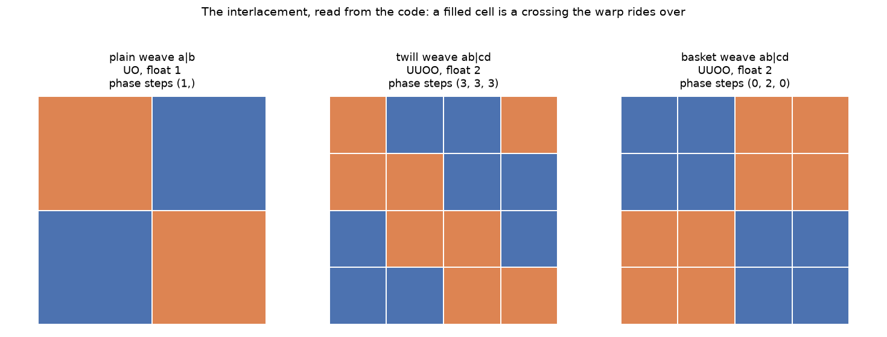

## What it gives

Measured by `tools/probes/the_weave_as_an_interlacement.py`, against the
tilings above for scale.

A code's two halves are its warp and its weft, and they are written here
as a pair because a pipe would end a table cell.

| Weave | loom | strands | classes | pattern | float | phase steps |
|---|---|---|---|---|---|---|
| plain weave, `a` and `b` | 2 by 2 | 4 | 1 | `UO` | 1 | (1) both ways |
| twill weave, `a` and `b` | 4 by 4 | 8 | 1 | `UUOO` | 2 | (3, 3, 3) both ways |
| twill weave, `ab` and `cd` | 4 by 4 | 8 | 1 | `UUOO` | 2 | (3, 3, 3) both ways |
| basket weave, `ab` and `cd` | 4 by 4 | 8 | 1 | `UUOO` | 2 | (0, 2, 0) both ways |
| twill weave, `a` and `b-` | 4 by 4 | 6 | 2 | `UO` and `UUOO` | 1 and 2 | (2) and (1, 0, 1) |
| plain weave, `ab-` and `cd-` | 6 by 6 | 8 | 1 | `UO` | 1 | (1, 0, 1, 0, 1) both ways |

One strand class for a plain weave and one for a twill, against two edge
classes for `laves 3.3.4.3.4`: the labels are fewer than a tiling's,
they are the interlacement itself rather than an artefact of
measurement, and nothing here can move with the aspect, because the
aspect is not among the inputs. The per-strand sequence alone is not
enough, however, and the table says why. A twill and a basket both ride
over two and under two, so both read `UUOO`, and anybody can tell them
apart by eye; what separates them is the phase between neighbouring
strands, a twill stepping by a constant amount, which is what draws its
diagonal, where a basket repeats in blocks. With that second reading the
three biaxial families come apart.

The dropped strand then behaves as one would want without a rule written
for it, which is the sign that the model is doing the work rather than
our bookkeeping. `twill weave a|b-` has six strands rather than eight,
the missing one absent rather than hollow, and its neighbours' floats
lengthen, which is what happens in cloth when a strand is left out. Its
two directions differ as well, `(2)` one way against `(1, 0, 1)` the
other, and that asymmetry is right: dropping a strand from one direction
is not a symmetric act, and a structure that reported it as one would be
describing a different cloth.

## What these invariants do and do not settle

The table above reads as more conclusive than it is, and three limits
are worth stating before anybody builds on it. The float and the phase
together separate the biaxial families we measured, but they are not
shown to be *complete* invariants, and we have no argument that two
genuinely different weaves must differ in one of them; they should be
treated as a discriminator that has worked so far rather than as a
normal form. The phase, further, is well defined only up to a strand's
own period. Our reading takes the first cyclic shift that carries one
strand's sequence onto its neighbour's, and where a sequence repeats
within its own length several shifts do, so the number reported is the
smallest rather than the only one; for `UUOO` in a four-cell repeat the
shift is unique and the readings above are safe, and for a longer or
more repetitive pattern the convention would have to be stated.

Triaxial weaves, finally, are not measured here at all. Every family but
`cube` is biaxial, and a triaxial crossing involves three strands rather
than two, so which one rides over is an ordering rather than a choice,
and the float-and-phase pair may simply be the wrong shape of answer
there. The cube weaves also refuse the geometric construction of part
one, for a separate and separately diagnosed reason
(`tools/probes/why_a_cube_weave_refuses_a_topology.py`), so a reader who
wants triaxial weaves should expect to start further back than this note
does.

# Part three: the join between the model and the drawing

The interlacement says what a weave is and carries no geometry, while an
edit moves geometry and nothing else. The obvious objection to the whole
of part two is therefore that it answers a different question from the
one the Topology tab asks, and an earlier draft of this note conceded
the point and left the join as the open problem. But it is not open. The
two sides can be matched, and the match is worth making as a
'differential', which is the shape that has found most of this project's
real defects: two independent descriptions of one thing, compared, so
that a disagreement is a defect by construction rather than a judgement.
`tools/probes/the_join_between_a_weave_and_its_drawing.py` builds both
sides and compares them, and the arrangement is honest because the loom
side knows nothing of the aspect while the geometry side knows nothing
of over and under.

## Every drawn piece is a float

The observation the join rests on is one part two arrived at sideways
and did not stop to use. A flat drawing cuts a strand wherever it passes
beneath, so what survives of a strand in the picture is exactly its
*floats*, the maximal runs of crossings it rides over; piece and float
are one thing seen from two sides. That makes the attribution computable
from the geometry alone, with no appeal to the code. A drawn piece
measures one strand width across and something longer along, so the
direction it runs in is the axis whose extent equals `aspect * spacing`,
the line its centre sits on says which strand of that direction it
belongs to, and its length along its own axis is the float it draws.
Nothing in that is a heuristic. The one coincidence that could spoil it
is declared rather than guessed past: at an aspect of exactly 0.5 a
float of one is as long as it is wide, and eight of a twill's sixteen
pieces then measure a strand width both ways, so those are settled by
the strand lines the unambiguous pieces have already drawn, which is
information in hand rather than an assumption.

## What the differential says

Five weaves at four aspects, twenty rows, and every row agrees.

| Weave | tiles | strands drawn | strands threaded | floats | pieces per strand | classes from the code | classes from the drawing |
|---|---|---|---|---|---|---|---|
| plain weave, `a` and `b` | 4 | 4 | 4 | 4 | 1 | 1, sizes [4] | 1, sizes [4] |
| twill weave, `a` and `b` | 16 | 8 | 8 | 8 | 2 | 1, sizes [8] | 1, sizes [8] |
| basket weave, `ab` and `cd` | 16 | 8 | 8 | 8 | 2 | 1, sizes [8] | 1, sizes [8] |
| twill weave, `a` and `b-` | 8 | 6 | 6 | 6 | 1 and 2 | 2, sizes [4, 2] | 2, sizes [4, 2] |
| plain weave, `ab-` and `cd-` | 16 | 8 | 8 | 8 | 2 | 1, sizes [8] | 1, sizes [8] |

Every drawn piece is attributed to exactly one strand, at every aspect
and on every weave, with no piece left over and none claimed twice; the
number of strands the drawing shows is the number the code threads,
which is the first thing that could have failed and did not; and the
partition of strands into classes has the same shape read either way.
Three agreements, none of them arranged.

Two cautions belong with that table, since it would be easy to read it
as settling more than it does. The comparison is of the partitions'
*shapes*, the number of classes and their sizes, rather than of their
memberships: the two sides name their strands differently, the loom by
row and column and the geometry by which line a piece sits on, and
nothing here shows that loom row zero is the leftmost line. A
disagreement in shape would be a disagreement whatever the naming, which
is what makes the test worth running at all; even so, an agreement in
shape is weaker than an agreement in membership, which the next section
takes up. Five weaves, moreover, is five weaves. It is the biaxial
families in the catalogue, with and without a dropped strand, and it is
not the whole catalogue.

## The membership question, and the handle that answers it

Asking which drawn line is which loom row looks like the obvious next
measurement, and the first attempt at it fails for a reason worth
recording. Within any one direction every strand of these five weaves
carries the same float signature, so ordering the strands by signature
decides nothing and the probe reports the question as undecidable rather
than answering it, which is the right behaviour: an instrument that
agreed with itself here would be reporting its own construction.

The quantity that does vary between neighbours is the phase, which is
what separates a twill from a basket in the first place, and it can be
read off the drawing without consulting the code. A piece is a float, so
where a strand's pieces begin along its own axis is where its floats
begin, and the offset from one strand's starts to the next one's is the
same thing the loom reports as a phase step. Read both ways the
sequences agree in shape on all five weaves. On `plain weave a|b` and on
the basket they are identical; on `twill weave a|b` the drawn sequence
is the loom's negated modulo the repeat, which is a direction convention
nothing had fixed in advance; and on the two weaves with a dropped
strand the pattern matches while the values do not, `(1, 0, 1)` against
`(2, 0, 2)` on `twill weave a|b-`, which we have not run down.

What that establishes is worth stating precisely, being less than a full
correspondence and a good deal more than nothing. The phase invariant
survives the projection: whether the steps are constant or blocked, and
where the zeros fall, is recoverable from the polygons alone, and that
shape is exactly what tells a twill from a basket. What is not
established is the absolute correspondence between a loom row and a
drawn line, and on the hyphen weaves there is a residual we cannot yet
account for.

## What the join buys

The drawing's own partition is invariant across the four aspects on
every weave tried, which is the property all of part one lacked and the
reason any of this matters: the classes read off the geometry now behave
like the classes read off the code, because they are the same classes
reached from the other end. The same probe also measures the clear air
between neighbouring strands of one direction, centre to centre less one
strand width, and it comes back as 0.100, 0.250, 0.500 and 0.750 of the
spacing at aspects 0.9, 0.75, 0.5 and 0.25 on all five weaves. That is
exactly one minus the aspect, which is what it ought to be and is worth
having measured rather than assumed, and it is the ceiling on how far a
strand may be moved across its own direction before it meets its
neighbour. Being a function of the strand width and of nothing else, it
has a consequence for how an edit should be recorded, which part four
takes up.

# Part four: three absences, and what an operation must preserve

## Three absences that look alike

A thin weave's drawing is mostly empty ground, and nothing in the
picture says why any particular piece of it is empty. Three mechanisms
open it, and separating them settles most of what a weave's structure
ought to ignore.

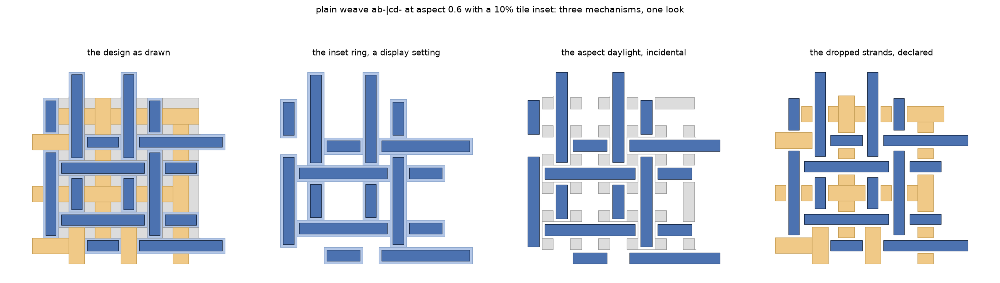

On `plain weave ab-|cd-` at aspect 0.6 with a tile inset of a tenth of
the spacing, the inset ring is 0.22 of the ground the design would
occupy at full width, the aspect daylight 0.16 and the dropped strands'
bands 0.27 (`tools/probes/three_kinds_of_absence.py`). Three quantities
of the same order, three mechanisms of quite different standing, and
nothing in the drawing to tell them apart.

## Where each one enters, which is what decides its treatment

The useful question is not what each absence looks like but where in the
making of the design it enters, since the structure is a function of
whatever has happened by the time it is taken.

An inset is applied to the finished unit. It is the last step of the
chain that builds a design, every step before it preserves the tiling,
and the un-inset design is one call back; nothing about an inset, then,
is a fact about the weave, so what it wants is not a rule for reasoning
about it but a decision not to apply it yet, which is what the rulings
for tilings already say. A weave takes an inset the same way a tiling
does, incidentally, and the figure above is a `WeaveUnit` with
`inset_tiles` applied after the fact, so the boundary that keeps weaves
out of the inset work is about the *aspect* rather than about insets as
such. An aspect, by contrast, looks as though it enters earlier, being
an argument to the same call that builds the unit. It does not. The loom
is computed from the strands code, the weave type and the over-and-under
alone, and the aspect enters only when polygons are drawn from it, so
the strand width is a parameter of the *drawing* rather than of the
design. That is not an argument from the shape of the code but a
measurement: the classes read off the geometry are the same at every
aspect tried (part three), and the classes read off the loom cannot move
with the aspect, the aspect not being one of its inputs. A dropped
strand is a hyphen somebody typed, and it changes the code, so the loom,
so the structure, in the plainest way observable: `twill weave a|b` has
one strand class and `twill weave a|b-` has two. It is also not a hole
in any useful sense. Nothing was threaded there, and what shows in the
cloth is that its neighbours float further, which is what a weaver would
say about it.

The criterion then falls out, and it is exactly the one the question was
put in terms of: the only absence that appears in the structure is the
one that enters *before* the structure is taken. No veto rule on an
adjacency graph is needed to get there, which is just as well, since
none of the ones we wrote worked. What settles it is choosing where to
read the structure from.

## What each candidate structure does with them

Three notions have appeared in this note and are worth naming, since
"the topology of a weave" has been doing duty for all three. The first
is the 'filled tiling's classes': the daylight is made into tiles, the
library derives edge and vertex classes over the result, and an edit is
aimed at one of them, which is what the plugin does today. The second is
the 'strand adjacency structure', in which strands are the things, the
relations between them are alongside and crossing, and the daylight is
attributed to whichever strand it replaces. The third is the
'interlacement': strands are continuous ribbons, a crossing carries
which of the two rides over, and no polygon has been drawn at all.

| | inset | aspect | dropped strand |
|---|---|---|---|
| Filled tiling's classes | invisible, where the structure is built before the inset | filled, and every filler tile brings its own edges | not filled, because the code says it was never threaded |
| Strand adjacency | invisible, same reason | absorbed into the strand it replaces | absent, and the neighbours are simply not adjacent |
| Interlacement | not an input | not an input | a strand that does not exist |

Reading down the columns is more instructive than reading across. Two of
the three absences are handled, in every treatment that works at all, by
knowing something the picture does not contain: where in the chain the
inset was applied, and what a hyphen in the code means. The one we
attacked geometrically is aspect, and it is the one that defeated every
geometric rule we wrote, until part two removed it from the question by
declining to measure polygons at all. That is a general enough shape to
be worth carrying away from this particular investigation.

## Operations, and why a weave's cannot be invariant in a tiling's sense

An operation on a tiling is aimed at an orbit of edges or vertices and
applied to every member at once, and two things make it safe: the result
is still a tiling, and the operation is defined on the structure rather
than on any individual edge, so it commutes with the symmetry the
classes came from. Coverage is what is preserved, and the orbit is the
unit of aim. Neither half carries over to a weave. Coverage was never
true of one below an aspect of 1.0, so it cannot be what an edit
preserves; and an edge class of a filled tiling is not a stable name to
aim at, the same weave at a different strand width returning a different
number of them. What a weave has in place of coverage is its
interlacement, which gives the condition directly: an operation on a
weave is admissible when the *interlacement* is unchanged, the same
strands crossing the same partners in the same order with the same
floats.

That is a condition one can check, and it is the condition we had
already arrived at empirically without recognising it: an edit survives
provided a strand does not move across a crossing. The geometry may be
pushed about freely so long as no strand changes its place in the order,
because the over and under is settled when the pieces are built and
travels with them. The unit of aim changes as well. An edit on a tiling
is aimed at an edge class, where an edit on a weave is aimed at a strand
and moves that strand's two long edges in phase, a ribbon of constant
width being what reads as yarn; what it can be aimed at collectively is
therefore a *class of strands*, and part three is what turns that from a
wish into a usable instruction, the classes being few, readable off the
drawing as well as off the code, and steady as the strand width varies.

## Three consequences worth writing down

Three practical things follow, and each of them bears on machinery that
already exists. The record must name a strand rather than an edge class,
since an edit ought not to be recorded against a label that moves with a
drawing parameter and the filled tiling's labels do exactly that; a
weave edit that is to survive a change of strand width has to name a
strand or a class of them. The clamp, by contrast, is precisely a
function of the aspect where the edit is not: part three measures a
strand's room as one minus the aspect, so the same displacement is legal
at 0.25 and refused at 0.9, which is the shape of a rule this project
already holds for the zigzag, hold what was asked and clamp on the way
to the screen rather than writing the clamp back into the record, where
it would ratchet and never give the value back when the design regained
room. And a hyphen is a change of design rather than of appearance:
dropping a strand changes the set of strands and so the alphabet an edit
was aimed at, which is the case the existing rule about a shelf key
already covers, the replay applying what matches and reporting which
edits now point at a changed design. Typing a hyphen ought to report as
one.

## What is not an operation of this kind

It clarifies the boundary to say what falls outside it. Changing which
strand rides over, re-phasing one family against the other, and dropping
or adding a strand all change the interlacement, which is to say they
make a different cloth; they belong with the strands code and the
over-and-under box, where somebody is composing a design, rather than
with the handles on the Topology tab, where somebody is moving a design
they already have. The line between the two is not a matter of how large
the change is. It is whether the thing that comes out is the same cloth.

# Part five: building both readings

Parts three and four leave a design rather than a thing. What follows is
the record of building it, and of the two corrections the maintainer
made to the design while it was being built, each of which was better
than what it replaced.

## The reading is applied by rebuilding, not by labelling a region

The first correction came from a mark-up of the drawing. One aperture in
a weave with a dropped strand is not of one provenance: part of it would
be there with every strand threaded, and part only because one is
missing. Labelling apertures by cause therefore forces a combination per
aperture, and there are three causes, so eight combinations. Worse,
"opened by the hyphen" is itself ambiguous between the band a hyphen
opens at full width and the extra it opens at a given strand width, and
choosing between those is another arbitrary decision of exactly the kind
part one died on.

The way out is to decide per CAUSE and evaluate by rebuilding. Each of
the three removes cloth monotonically, so instead of asking what opened
a given patch of ground, set the causes ruled non-consequential to their
neutral values, rebuild the design, and take the holes of that. Three
independent decisions, three rebuilds, no region-labelling and no
marginal-effect ambiguity anywhere.

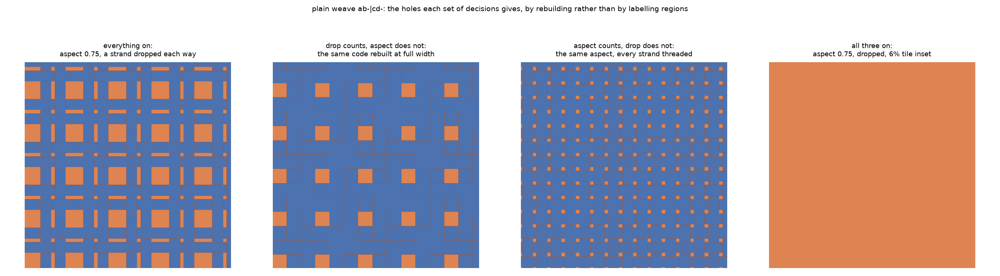

Two things fall out of that picture. The second and third panels are
each clean and regular, which is what says both readings are workable
rather than one being a concession. And the fourth is the argument about
insets that the earlier parts of this note were missing: with a six per
cent tile inset the whole patch is one connected region, because an
inset opens a channel between every pair of tiles and joins every hole
to every other. An inset does not add holes. It dissolves them, and that
is a mechanism for neutralising it rather than a convention about the
order of a pipeline.

## A quotient, not a rebuild

The second correction is the one the implementation rests on. Applying
the reading that ignores aspect gaps by REBUILDING at full width fights
the library three times over, and each was measured rather than guessed.
At exactly 1.0 the assembly fuses same-label pieces, so a twill's
sixteen tiles become two. Just below it, at 0.999, the residual daylight
is a hairline of 0.00028 square units on `twill weave a|b-`, which
upstream's `get_clean_polygon` reduces below four corners and raises on.
And closing that hairline by growing the strands fuses them again, a
plain weave's four pieces becoming two. The correspondence between a
thin weave's pieces and a full-width weave's is a bijection on the plain
weaves alone and on neither twill nor the basket, so an edit could not
have been carried back by geometry either. The maintainer's construction
does it in the STRUCTURE instead. A rectangular aspect hole is read as
though the strands on opposite sides of it were touching, which is two
adjacencies rather than four independent edges, and its four corners are
then one point. Nothing moves, so none of the three failures above can
arise.

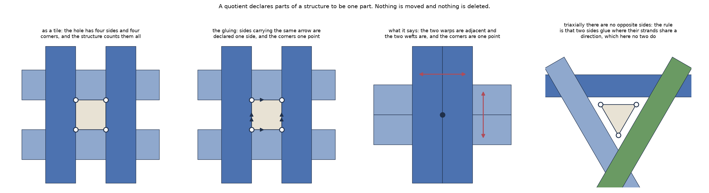

The triaxial generalisation is worth stating even though it is not yet
measured. "Opposite" is an accident of the rectangle. The structural
rule is that two sides of a hole glue where their strands belong to the
same family, which in a rectangle is the opposite pair and in a
triangular triaxial aperture is no pair at all, the three sides
belonging to three directions that already cross each other elsewhere. A
hexagonal triaxial aperture would have same-family pairs again.

## What the two readings give

Both readings scaffold the design as drawn. The difference is that one
keeps the aspect daylight as tiles of the structure and the other glues
each such hole away afterwards, so a caller that merely passed a reading
without gluing would get the same answer for both, with nothing to say
so. `weave_topology` therefore applies the gluing itself.

| Weave | aspect gaps count | aspect gaps ignored |
|---|---|---|
| plain weave, `a` and `b` | 10 edge, 7 vertex | 6 edge, 3 vertex |
| twill weave, `a` and `b` | 6 edge, 4 vertex | 4 edge, 1 vertex |
| twill weave, `a` and `b-` | 52 edge, 30 vertex | 37 edge, 11 vertex |
| plain weave, `ab-` and `cd-` | 204 edge, 136 vertex | 136 edge, 34 vertex |

Both hold still from aspect 0.9 to 0.5 on every weave. At 0.25 the
daylight of a twill fragments into twenty-five pieces rather than
sixteen and both readings move with it, which is a fact about the
filling rather than about either reading.

## Does an edit actually cross the gap?

That the classes differ does not establish that anything useful follows.
The question the whole construction has to answer is whether an edit
aimed at a glued class reaches the strands on BOTH sides of the hole,
since that adjacency is the entire content of gluing it. One piece had
to be built for that. Under the glued reading a class stands for several
of the library's own labels, and the library selects edges by label;
unless the class is expanded first, an edit reaches one side of a hole
and leaves the other, which would make the gluing's assertion false at
the moment it mattered.

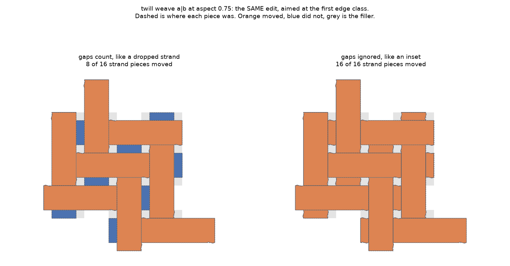

Measured on `twill weave a|b` at aspect 0.75, aiming a zigzag at the
first edge class moves eight of sixteen ribbon pieces under the unglued
reading and sixteen of sixteen under the glued one, the class having
widened from one library label to two. The control is the unglued arm,
which moves strictly fewer pieces of the same design under the same
edit.

TWO WRONG INSTRUMENTS PRECEDED THAT NUMBER and both read as answers.
Ground moved doubles under the gluing, which one strand moved twice as
far would also do. Then counting the strands touched came back "a, b"
for both readings on every weave, because `tile_id` on a strand is the
ELEMENT letter and a plain weave's four pieces share two of them: an
instrument aggregating over the distinction under test, which this
project has a lesson about and which was walked into anyway.

The plain weave cannot discriminate here, its four pieces moving either
way. And on `twill weave a|b-` the first of fifty-two classes moves no
cloth at all, being a class of the scaffolding rather than of any
ribbon, which is a real consequence of the counting reading: most of the
classes it offers are filler, and nothing yet says which touch yarn.

## Classes that stay on one strand family

The drawing above raises a question the maintainer put next. Under
either reading a class jumps between the vertical sides of some holes
and the horizontal sides of others. That is not the gluing's doing: it
is there unglued too, where class `a` holds 81 vertical edges and 80
horizontal ones on a twill. The cause is that the library takes orbits
under the design's FULL symmetry group, and a weave's geometry admits a
mirror along its diagonal carrying warps onto wefts. A cloth has no such
symmetry. Warp and weft differ physically whatever the drawing does, one
held under tension and one carried across, so the swap is a symmetry of
the picture rather than of the weave. That is this note's own thesis
arriving somewhere new.

What is wanted is orbits under the DIRECTION-PRESERVING SUBGROUP. Every
symmetry either fixes the two strand families or swaps them, which is a
homomorphism onto a group of order two; its kernel is normal, of index
one or two, and its orbits refine the library's. A class splits in two
exactly where no swapping element lies in the stabiliser of any of its
edges.

| Weave | aspect gaps count | count, strandwise | gaps ignored | ignored, strandwise |
|---|---|---|---|---|
| plain weave, `a` and `b` | 10 | 20 | 6 | 12 |
| twill weave, `a` and `b` | 6 | 12 | 4 | 8 |
| basket weave, `ab` and `cd` | 31 | 62 | 19 | 38 |

Every class splits, on three weaves, both readings and three strand
widths, with no exception. Copies under the lattice never disagree on
their refined label, and the counts do not move with the strand width
(`tools/probes/classes_that_stay_on_one_strand_family.py`). What is
measured there is a PROXY: the refinement is taken by each edge's own
orientation, which agrees with the subgroup's orbits while the index is
two and the only direction-mixing is the swap. Computing the subgroup
properly means reading `tile_matching_transforms` and keeping the
transforms that carry a direction to itself. Triaxially the map lands
in a group of order six rather than two, so a class could split six
ways.

That is now what the plugin does, and taking the second road turned out
to teach something the first could not. The library's list of matching
transforms is not a group. It is assembled from shape matches and
closed under nothing, and each entry is a partial relation, since the
library seeks a transformed element's image among the base elements
alone and gives up where it lands on a copy. Orbits taken under that
list as it stands do not even reproduce the library's own classes: 12
edge classes on the plain weave where it reports 10, and 37 on the
basket where it reports 31. Dropping the direction-swapping members of
such a list therefore splits classes twice over, once for the reason we
want and once because a PRODUCT of two swapping transforms preserves
direction and is simply missing. The plain weave came back with 23
classes rather than 20; the basket with 67 rather than 62.

Adding every pairwise composite repairs it, and the repair carries its
own proof. The enlarged pool reproduces the library exactly, 10, 6 and
31 edge classes on the three weaves, so orbits taken under any part of
it are a refinement of the classes somebody is actually looking at.
Its direction-preserving half then gives 20, 12 and 62, which is the
orientation proxy's factor of two arrived at along a quite different
road. Two independent constructions agreeing is the only kind of
agreement worth much here, and this is one. The agreement is also asked
as a control at every build: where orbits under the whole pool fail to
reproduce the classes on screen, nothing is split and the reason is
said, since a refinement that is not a refinement would move an edit
onto edges nobody chose.

One more measurement is worth having, and it is the one that persuades
us the construction is about direction rather than about arithmetic.
The refinement is not a uniform doubling. `twill weave a|b-` does not
split at all: 52 edge classes counting and 37 glued, under either
setting, with no class holding two directions before anybody asks. A
hyphen is a strand somebody left out, so that drawing has no mirror
carrying warps onto wefts, and there is nothing for the refinement to
disbelieve in. It costs twice exactly where the picture has the
symmetry a cloth does not, and nothing where the weave's own code has
already broken it.

## Two switches, not one

The last correction is that these are independent questions. Whether an
aspect gap counts is one; whether a class may hold edges of both strand
families is another, and it applies under either answer to the first.

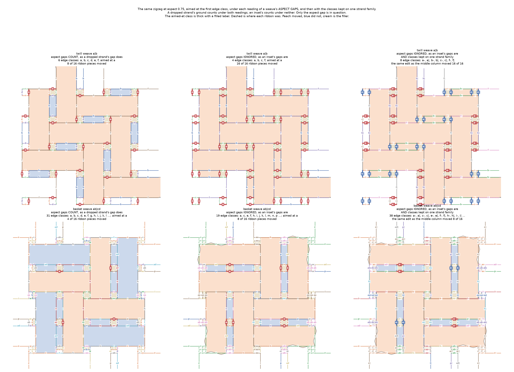

The two are not equally open, though. The aspect question is a research
decision with defensible answers on both sides, which is why the tab
carries a control for it. The strandwise question has an argument that
points one way only, since the warp-weft swap is never a symmetry of
cloth. It is a control today because we would rather you saw both
answers than took ours; if you agree that a cloth settles it, the
honest next move is to make it how a weave's classes are always
computed and retire the chooser.

## What is built, and what is not

Built: `scaffolded_weave`, `weave_topology` and `glue_the_aspect_holes`
in `topology_edits.py`; the selector expansion that carries an edit
across a glued hole; `class_labels`, which returns labels as labels
rather than joined into a string; and a chooser on the Topology tab
reading "Count, like a dropped strand" against "Ignore, like an inset",
which queues a fresh topology and drops the selection when it moves.

Built since: the strandwise refinement itself, as
`keep_warp_and_weft_apart`, under a second chooser reading "Together, as
the drawing's symmetry has them" against "Apart, as a cloth has them".
An edit CAN now be aimed at one strand family, which had looked
impossible while we thought of the refinement as something the
library's selector would have to express. It cannot express a split;
what it can do is take whatever labels the classes carry. So the
refinement rewrites the labels rather than mapping them, and the
chooser, the drawing, the replay and the gluing all learn about the new
classes at once. The refinement runs before the gluing, and no gluing ever
unions two classes of different direction, since an aspect hole's
opposite sides are parallel.

What an edit then reaches is a further question, and measuring it
corrected something we had asserted. An edge's direction is not the
strand family that owns it. A horizontal edge is the flank of a weft,
or it is the END CAP of a warp. The quotient declares an aspect hole's
opposite sides one side, which on the twill unions a class of 64 weft
flanks with a class of 69 warp end caps: one class, running in one
direction, owned by strands of two families. So an edit aimed at a
refined class moves four of the twill's sixteen pieces in one direction
under the counting reading, and eight in both under the glued one. On
the plain weave it is two of four in one direction under either
reading, because every strand edge there abuts filler and the two
questions coincide. Identifying those two sides is what the quotient
MEANS, so this is a property of putting the two switches together
rather than a fault in either. If you want an edit that is guaranteed
to stay on one family under the glued reading, the refinement would
have to be by the strand an edge belongs to rather than by the
direction the edge runs in, and that is a decision rather than a
repair.

A test now guards it on the plain weave under both readings, asserting
three separate things: that the split is a refinement rather than a
renaming, that no class left holds edges of two directions when the
DRAWN edges are asked rather than the construction, and that the
premise holds at all, since a design whose classes already kept to one
direction would pass the rest without the refinement doing anything.
Three catalogue entries break it three ways and each is watched to
fail. The tab itself has been wired rather than driven; somebody should
still open the plugin and move both choosers.

Not built: any of this on a triaxial weave, where the homomorphism
lands in a group of order six rather than two. All three cube weaves
refuse the scaffolding for a separately diagnosed fault, so the sixfold
case is written and untried.

TWO SMALLER THINGS SURFACED WHILE BUILDING IT. The cube weaves refused
the scaffolding at `get_clean_polygon`, which ends in `set_precision` at
a millionth and hands back a MultiPolygon that `get_corners` asks for
`.exterior`; snapping our own filler to the same grid first clears that
raise on two of the three, and what remains is the library moving
corners in its own regularising step, with our scaffolding measured as
an exact partition going in. And the two-letter class label the roadmap
had filed as latent became live the moment anything built on the
scaffolding, since a weave passes twenty-six classes at once and the
selector's joined string cannot be split back past `z`.

# Part six: where this leaves us

## Which structure, for which question

The question "what is the topology of a weave" has three answers here,
and they are not competitors, because they answer different things. For
what a weave *is*, the interlacement: it is small, it comes from the
specification rather than from a measurement, and it holds the one thing
a weave is about, so if somebody asks how many classes a weave has, this
is the number to give them. For *where each strand lies*, the geometry,
addressed through the join of part three, which is what an edit needs
and is now derivable rather than merely wished for. The filled tiling's
classes are neither. They are an implementation device that lets a
library insisting on a gap-free tiling accept a design that is not one,
and they work as such, sixty-five weaves of seventy-seven coming back
through them; what they should not do is appear in front of somebody as
the weave's own structure, since that is what they are not.

Of what precedes, the interlacement model, the typed cutting of the
daylight, the attribution of daylight to what it replaces, and the join
between the code and the drawing are all built, each with its probe
under `tools/probes/`. Everything in part four about operations is
measured and not built: the admissibility condition is stated and its
ingredients exist, and nothing yet enforces it, since making an edit aim
at a strand class is a change to the Topology tab and the maintainer's
to schedule. Three things remain open, and the list is short enough to
be worth having: the correspondence between a loom row and a drawn line,
of which part three establishes the phase and not the absolute matching;
triaxial weaves, which are not measured here at all; and any weave
outside the five in part three's table.

## What stacking edits does, which we had not looked at

Everything above measures one edit at a time. Edits chain, though, and
the plugin never rebuilds between them, so we went and looked at what
accumulates. The answer splits cleanly in two, and the halves point
opposite ways.

The cloth survives everything a tiling check can ask. Six deliberately
harsh edits on the plain weave leave every intermediate design laying
out, the strands covering the same 0.937 of a cell they started with,
the daylight between them open, and no strand crossing another. On that
evidence the scaffolding route holds up under accumulation rather
better than we expected.

What does not survive is the ribbon. A strand's width along its own
axis varies by 51.4% after a single rotate on the twill at aspect 0.5
with its gaps glued, and by 93.8% after three stacked — a strand
pinched almost through at one end and full width at the other. That is
ruling 3 of the scaffolding rulings, the one saying an edit moves a
strand's two long edges in phase, failing in practice rather than in
principle. It is worst where the aspect is low and where the gaps are
glued, which makes sense: both widen the class an edit reaches.

The uncomfortable part is that nothing says so. `still_has_a_topology`
answers True through all of it, because it asks whether the result is
gap-free, and a gap-free result is exactly what the scaffolding
guarantees. A weave makes two further promises that no tiling check can
see, and only one of them — the daylight staying open — actually holds.

So this is the argument for the admissibility condition that has been
stated and not built. The unit an edit is aimed at ought to be a strand
class rather than an edge class, and until it is, an edit on a weave can
stop the cloth reading as cloth while every instrument the plugin has
reports success. We have left the number reported rather than enforced,
since a limit above 93.8% would catch nothing and one below it would
turn ordinary journeys red, and a threshold nobody can act on is worse
than a number somebody reads.

One caution about how this was found, because it nearly went the other
way. The figure we drew to look at the stacking reported two things
that were not true: that every strand had come off its axis, and that
the daylight had closed. Both were faults in the drawing — a colour
chosen by rounding an angle that is only defined modulo a half turn,
and panels each scaled to their own contents so that a step whose
pieces moved outward was quietly zoomed. The area measurement beside
them refuted both. It is a small thing and a general one: a picture is
only as trustworthy as the arithmetic its colours and its axes are
chosen by, and a visual finding is worth asking what number would move
if it were true.

## Two smaller things that are unfinished

The absorbing construction of part one works on one weave of the four
tried. `plain weave a|b` comes down to eleven edge classes and seven
vertex classes, stable at every aspect; the twill, the basket and `twill
weave a|b-` all refuse inside the library's own bookkeeping at every
aspect, and the last of those does not even tile exactly, carrying an
overlap of about 0.19 of a cell at aspect 0.9
(`tools/probes/does_a_weave_topology_stay_small.py`). We had recorded
this as one failure of four and it is three, which is worth correcting
here because a construction of that kind reads far better on one line of
a table than it deserves to.

Past twenty-six classes, meanwhile, the library issues two-letter
labels, `aa` after `z`, while our own helper returns the labels joined
into one string, which cannot be split back once any of them runs to two
characters. A thin twill at aspect 0.25 is already past that boundary,
so anything built on the filled tiling has to treat a class as a label
rather than as a character.

## The thing that would make most of this unnecessary

Behind all of it sits the observation that a strand is more naturally a
path than a row of tiles. Were the grid a weave rides on to carry the
undulation, the strand would keep its width, nothing would need filling
or absorbing at any aspect, and most of the choices set out above would
not have to be made at all: the interlacement would then be the design
rather than a model recovered beside it, and the join of part three
would be a construction rather than a measurement. That is upstream's
territory as much as ours. We would be glad to be shown that the
question has a tidier answer than the one we have reached.