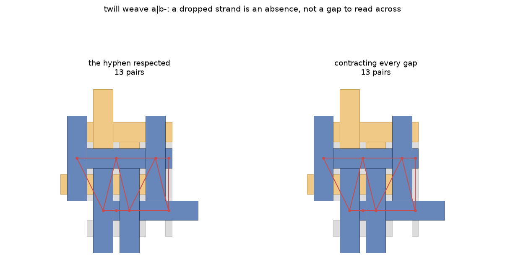

# The topology of a weave, and what its holes have to do with it

The Topology tab refuses every weave in the catalogue, which is more
than half of it. This note is the record of why, of the constructions
we tried, and of what we now think a weave's structure ought to be
computed from. It is written for whoever picks the question up next.
docs/TOPOLOGY.md points here rather than carrying the argument.

The short version has three parts. A thin weave can be given a
structure by treating the daylight between its strands as tiles, and
that works. The structure you get that way belongs to the weave and to
your cutting of the holes together, which we can demonstrate rather
than merely worry about. And the way out is to stop treating the holes
as one thing: cut them by what each piece is *for*, and then decide
what to do with each kind, at which point most of the difficulty
dissolves.

## What a weave is made of, and why that matters here

A weave in this library is not a tiling that has been thinned. Its
strands are generated from a grid: the code `ab-|cd` says which
elements ride in which of two directions, a hyphen marking a strand
deliberately left out, and the `aspect` gives each strand's width as a
fraction of the spacing between them. At an aspect of 1.0 the strands
meet and the plane is covered. Below it they do not, and the design has
holes by construction rather than by accident.

That construction is why several obvious repairs fail. A strand piece
at a low aspect is not a solid one shrunk: it is narrower across its
axis and *longer* along it, which is what keeps a ribbon continuous
where it passes under another. Nothing that uniformly shrinks a solid
weave reproduces a thin one.

## Why the tab refuses one

`Topology` requires a gap-free tiling. Its constructor lays a patch of
repeats, matches the corners of one tile against its neighbours, and
derives the transitivity classes of edges and vertices that an edit is
later aimed at. A design that does not cover the plane has no such
structure to derive, and the constructor says so. A weave below aspect
1.0 therefore arrives already refused, and the refusal is correct.

## What we tried first

| Approach | Gap-free? | Same weave? | Notes |
|---|---|---|---|
| Build at aspect 1.0 | yes | no | the library fuses same-label pieces; a twill's sixteen tiles become two |
| Build at aspect 0.999 | no | nearly | a millionth of a cell of gap still refuses; the constructor is not asking about size |
| Inset a solid weave | yes, but wrong | no | an inset shortens where thinning lengthens, about 40% wrong on a plain weave |
| Treat the holes as tiles | yes | yes | the strands are untouched; the daylight becomes tiles beside them |

The first is the one to be clear about, because it looks like the
obvious answer. Going solid does produce a tiling, but not of the same
design: at an aspect of 1.0 the assembly dissolves adjacent pieces that
share a label, so the sixteen strand tiles of `twill weave a|b` become
two, and the structure derived from them is the structure of something
else. The over-and-under pattern that makes a weave a weave has gone.

## Holes as tiles

The route that works is to give the daylight to the design. We take the
uncovered ground of one fundamental cell, cut it into single-part
pieces, give each piece its own tile id, and hand the library a unit
whose tiles are the strands together with those pieces. The result
covers its cell exactly, `Topology` accepts it, an edit can be applied,
and dropping the filler afterwards leaves the original strand tiles
valid. It closes the round trip on sixty-five of the catalogue's
seventy-seven weaves.

Two details are load-bearing and neither is obvious. Every filler piece
needs its own id, because the library's regularising step dissolves
tiles by `tile_id`, and pieces sharing one merge into a multi-part tile
whose corners it then cannot take. And each piece is snapped to the
library's own precision before being handed over, since a piece that
pinches at that precision is split by `set_precision` inside the
library's own cleaner, and the multi-part result reaches a function
that asks it for its exterior ring.

## Whose structure is it?

If we invent the holes, the classes an edit is aimed at may be a fact
about our invention. The obvious test is invariance: holding a weave
fixed and varying its strand width changes every coordinate and none of
its combinatorics, so a structure that moves with the aspect belongs to
the filling.

On `plain weave a|b` it does not move. At every aspect from 0.9 down to
0.25 the filled design has four strand tiles and nine filler pieces,
covers its cell exactly, and carries ten edge classes and seven vertex
classes with a dual of twenty-five tiles.

On `twill weave a|b` it holds and then breaks. At 0.9, 0.75 and 0.5 the
design is sixteen strands and sixteen filler pieces with six edge
classes, four vertex classes and a sixty-four tile dual. At 0.25 the
same weave's daylight falls into twenty-five pieces instead of sixteen,
the six and four become a hundred and twenty-two and eighty-one, and
the dual grows to eighty-one tiles. The break is not slivers: at 0.5
the sixteen pieces are congruent, every one of area 250,000 square
units, while at 0.25 the twenty-five take seven distinct areas from
15,625 to 562,500.

## The control that settles it

Invariance over a range is suggestive rather than decisive, so we
tested it directly: fill the same holes, on the same weave at the same
aspect, two different ways. Cutting each filler piece in half across
its own middle is not a better filling and is not meant to be. It
covers exactly the same ground.

Both leave a gap and an overlap of zero and both leave the strands
untouched. Taken as the difference gives them, the sixteen pieces yield
six edge classes and four vertex classes. Halved, the twenty-two pieces
yield 114 edge classes and 76 vertex classes.

So the classes are a property of the weave together with a
decomposition of its holes that we chose, and a different choice
covering the same ground gives a wholly different answer. What the
invariance of the previous section records is that the difference
operation happens to return congruent pieces over part of the range,
which is a fact about our construction rather than about weaving.

## Holes made of several kinds of tile

The way out is not a better arbitrary cut but a principled one, and it
comes from noticing that a hole need not be of one kind. In a weave
whose code drops a strand, a single connected hole is the missing
strand's own band together with the ordinary daylight flanking it.
Those are different things that happen to touch, and cutting them apart
is not a choice but a reading of what the design says.

`topology_edits.daylight_by_kind` already separates the two, by
building the same weave with each hyphen replaced by an unused letter
and taking the ground the ghost carries and the real design does not.
The aspect daylight then divides again, by which strand's width opened
it. Both cuts come from the weave's own construction rather than from
where a boolean operation chose to split.

Measured, the canonical cut behaves as one would hope. `plain weave
a|b` becomes four strands and sixteen aspect tiles, covering exactly,
with thirty edge classes and twenty vertex classes at every aspect from
0.9 to 0.25. `twill weave a|b` becomes sixteen strands and forty-nine
aspect tiles with 195 edge classes and 130 vertex classes, unmoved at
0.9, 0.75 and 0.5. The dependence that the arbitrary cut introduced is
gone.

What the typed cut does not do by itself is give a small answer.
Thirty edge classes for a weave of four strands is mostly an account of
the daylight, and it is the strands somebody wants to edit.

## What to do with the kinds, and the choice that matters

Once each hole tile carries what it is for, the constructions we had
been treating as rivals turn out to be settings of one machine: keep
every kind and you have the typed tiling, and treat the aspect kind as
not-really-there and you have something smaller. The interesting
question is what "not really there" should mean, and there are two
readings, which do not agree.

**Passing through.** Let a path run through aspect tiles, so two
strands separated only by daylight count as neighbours. This is
decomposition-free by construction, since it depends on the daylight as
a region rather than on any cutting of it, and it is invariant across
aspect: a twill reads sixteen strands and thirty-five adjacent pairs
with the same degree sequence at every width, including the 0.25 that
broke the filled construction.

Yet it is too generous, and the reason is worth stating because it is
not obvious from the pictures. The daylight of a weave is largely one
connected region, so a path may enter it beside one strand and leave it
beside any other. Counted properly, between strand orbits rather than
between copies in the patch, a plain weave's four strands come out with
all six possible pairs adjacent. A gap that everything touches makes
everything adjacent, and a complete graph is not a structure.

**Ownership.** Give each piece of aspect daylight to the strand whose
width opened it, and merge it in. Then the incidental gaps do not exist
to be traversed, each piece has exactly one owner and cannot act as a
hub, and what remains uncovered is only what a dropped strand left.

This is the one that behaves. `plain weave a|b` absorbs exactly at
every aspect, gap and overlap both zero, and yields six edge classes
and four vertex classes, identical at 0.9, 0.75, 0.5 and 0.25. Six and
four is the size of answer a four-strand weave ought to have, and it
does not move.

Two things about the implementation are worth recording, since both
cost a run. A single buffer of half the nominal gap suits a design
whose daylight is all one width, and a twill's is not: it left six
pieces unclaimed on a weave with no hyphen in it. Growing every strand
at the same rate until the daylight is used up needs no distance chosen
in advance and closes both. And a Voronoi over points sampled along the
strand boundaries assigns the same ground with stepped edges where the
true partition is a straight midline, which the library's regularising
step then raised on at two aspects of four.

## Attributing the daylight to what it replaces

Ownership needs a rule for whose daylight a piece is, and proximity is
the wrong one. At a crossing the ground was opened by two strands
retreating from it, and it belongs to neither one more than the other;
worse, a nearest-strand rule divides a hole along its diagonals, so
each piece faces one strand and meets the others only at points, which
is not the division the design suggests.

The canonical rule asks what each piece REPLACES: which strand would
have covered that ground had the yarn been drawn at full width. It is
computed the way `daylight_by_kind` computes a conscious gap, by
building a second weave and comparing. The reference is the same weave
at an aspect just below 1.0, since at 1.0 the assembly fuses pieces
that share a label and there would be nothing left to attribute to.
Every piece of daylight then goes to the full-width piece covering most
of it, with no distance measured anywhere.

Measured on three weaves at four aspects, it attributes every piece of
daylight and the absorbed regions partition the ground exactly, at an
overlap of zero. Two questions this raised are settled by it.

A pair of strands running ALONGSIDE one another stays adjacent. At full
width they would abut along a line, so they are neighbours, and the
worry was that carving each crossing hole among perpendicular pairs
would leave them sharing nothing. It does not: `plain weave a|b` has
its two `a` strands adjacent at every aspect from 0.9 to 0.25, and the
twill has both its `a` pair and its `b` pair.

And the diagonal is refused, without a rule written to refuse it. Two
absorbed regions at opposite corners of a hole meet at a point, and
adjacency here requires a shared segment rather than a shared point, so
no such pair is ever joined. Where those two strands genuinely cross
somewhere else, that crossing is where the relation is recorded, with
whatever over-and-under sense it has. An adjacency asserted across the
diagonal would be the same relation restated in a place where nothing
happens, and restated without the over and under, which is the part of
a weave worth keeping.

What the attribution gives is therefore a small, stable answer: three
kinds of relation on a plain weave, one alongside and one crossing, at
every strand width, with nothing left over. Two caveats belong with it.
The relations are reported by element letter, so they say that some
pair of `a` strands is adjacent rather than how many are; and at aspect
0.25 one or two pieces of daylight go unattributed on the twills, which
is a small hole in the rule rather than in the idea.

## Does it stay the size a tiling's structure is?

A tiling's topology is small. `laves 3.3.4.3.4` has four tiles with two
edge classes and two vertex classes, `archimedean 4.8.8` two tiles with
two and one, `hex-slice 3` three tiles with one and two. Any account of
a weave has to be comparable, or the labels are counting the method
rather than the design, and an edit aimed at one of a hundred classes
is not aimed at anything a person can hold in mind.

By that measure the constructions above divide sharply.

| Construction | plain weave a|b | across aspects |
|---|---|---|
| Tiling, for scale (`laves 3.3.4.3.4`) | 2 edge, 2 vertex | — |
| Holes kept as tiles, cut arbitrarily | 10 edge, 7 vertex | moves on a twill |
| Holes kept as tiles, cut by kind | 30 edge, 20 vertex | invariant |
| Daylight absorbed, then classes taken | 11 edge, 7 vertex | invariant |
| Relations between strands | 1 alongside, 1 crossing | invariant |

The typed tiling multiplies labels because every hole tile brings its
own edges: thirty for a weave of four strands, and 195 for a twill.
Absorbing the daylight helps and does not fix it. The plain weave comes
down to eleven and seven, stable at every aspect, but an absorbed
strand is its own rectangle together with the ground it claimed, so it
has a complicated outline, and each extra corner is another class. That
is still multiplication by measurement, only less of it. The twill does
not survive the step at all: the design tiles exactly, at a gap and an
overlap of zero, and the library then raises `ValueError: zip()
argument 2 is longer than argument 1` inside
`_assign_vertex_and_edge_base_IDs`, which is a count mismatch in its own
bookkeeping rather than anything about the geometry.

The last row is the one that behaves, and on reflection it is the right
comparison rather than a lucky one. A tiling's edge classes are
relations between tiles, so a weave's structure should be relations
between strands, and that is what stays small: one alongside relation
and one crossing relation on a plain weave, three on a twill, unmoved
at every strand width. It stays small precisely because it does not
inherit the polygons' corners. Absorbing the daylight is then how the
relations are COMPUTED rather than what should be labelled, and the
absorbed outlines are scaffolding in the same sense the filler was.

What is missing before this is a structure rather than a promising
number. The relations are currently reported by element letter, which
says that some pair of `a` strands is adjacent rather than which, so
the count is a lower bound on what a real accounting would carry. A
tiling's classes come with an incidence and a cyclic order at each
vertex, and nothing here has that yet. And a crossing has an over and
an under, which is the distinction a weave exists to make and which the
relation ought to record; adjacency as measured is blind to it.

## The over and under, which the geometry will not give up

A relation that says two strands meet, without saying which passes
over, has dropped the thing a weave is for. So we tried to read the
over and under off the shapes, three ways, and none of them works.

The first asked for direct contact, on the reading that the under
strand is cut flush against the over strand's edge. It is not: a plain
weave has no contacts at all between its thin pieces, at any aspect,
the cut being set back across the daylight, and the two a twill shows
come and go as the strand width changes. A relation that appears and
disappears with a measurement is not a relation of the design.

The second asked whose claimed ground reaches the other strand's own
edge, on the reading that the over strand covers the crossing at full
width and is therefore handed that ground by the replacement
attribution. It classifies two parallel strands as passing over one
another, leaves four relations of five unclassified, and stops being
invariant.

The third asked whether a strand meets its neighbour end-on or side-on,
which does not require them to touch. Every relation lands in the
ambiguous band: five of five unclassified on a plain weave, at every
aspect.

What that settles is not that the over and under are unavailable but
that the rendered geometry is the wrong place to look. Which strand is
cut at a crossing is decided by the strands code and the over-under
pattern before any polygon exists, and the library differences the
pieces accordingly; measuring the output to recover the rule is
reverse-engineering something already in hand, and three attempts is a
fair price to have paid for learning it.

The parallel with a tiling is closer than it first appears, and it
points the same way. The library does not measure pictures to find a
tiling's classes either: it derives them from the design's own
symmetries. A weave's combinatorics should likewise come from its
specification, and the geometry should be asked only what geometry is
good for, which is which strands are adjacent and where.

## The dropped strand, which is the one real gap

The distinction the whole exercise turns on is between a gap that means
something and a gap that is an artefact of how wide we chose to draw
the yarn. `daylight_by_kind` computes it, and the constructions above
use it. What we could not do is make it earn its keep as a rule about
adjacency.

Three formulations were tried against the passing-through structure,
and they bracket the answer rather than settling it. Declining to
bridge across conscious ground withholds nothing, on all three biaxial
weaves in the catalogue whose codes carry a hyphen: the strands either
side of a dropped strand are already neighbours by another route.
Refusing any daylight component that abuts conscious ground refuses 33
of 34 components on `plain weave ab-|cd-`, isolating twelve of its
sixteen strands, because the empty slot is a long band that most of the
daylight touches somewhere. And refusing pairs the slot lies between
finds none.

The honest reading is that a dropped strand does not *separate*
anything in these designs, since the fabric routes around it, and that
a rule strong enough to make it separate something severs a great deal
that has nothing to do with it. Under ownership the question does not
arise in this form: the dropped band is simply the ground nobody
absorbed, and it is a hole in the design rather than a prohibition on a
graph.

One measurement here was wrong before it was right, and the correction
is general. `daylight_by_kind` returns the width daylight as the whole
daylight less the conscious gap *buffered by a whisker*, so the two
regions are held about a millionth of a unit apart by construction and
their boundaries never meet. A veto written on boundary contact
therefore fired zero times on three weaves. A uniform verdict is almost
always the instrument.

## The dual inherits whatever the construction decided

A dual has one tile per vertex, so it can be no more canonical than the
vertices are. The filled plain weave duals to twenty-five tiles at
every aspect, the filled twill to sixty-four while its filling is
congruent and eighty-one once it is not. These are duals of the filled
design, and "the dual of a weave" becomes a definite phrase only once
somebody has said what the holes are. Where the construction is
settled, so is the dual, and it is a perfectly reasonable object to
map; what it is not is something one can quote without also quoting the
construction behind it.

## What this costs the tab

An edit on the Topology tab is aimed at a class, and on a weave the
classes do not line up with what somebody editing a weave would want to
take hold of. A strand's long side is not one edge but four or five,
cut by the filler abutting it at every crossing; the two long sides of
a strand share no class at all on a plain weave; and where they do
share one, whether the ribbon undulates at constant width or pinches
depends on whether that class's segments sit opposite each other. That
record is in `docs/process/weaving-and-topology.md`.

There is a smaller hazard worth flagging, since it is reachable at
ordinary settings. Past twenty-six classes the library issues
two-letter labels, `aa` after `z`, and our own helper returns the
labels joined into one string, which cannot be split back once any of
them is two characters. A thin twill at aspect 0.25 is already past it,
and so is the typed tiling of any twill. Anything built here has to
treat a class as a label rather than as a character.

## The weave as an interlacement, which is where this should have started

Everything above works on the rendered design, and the rendered design
is a projection. A flat map cannot show one ribbon lying on another, so
the strand passing under is cut, and the over-and-under is precisely
what the picture throws away. Three attempts to recover it from those
polygons failed, and in hindsight that is what should have been
expected: we were measuring a shadow for a fact it does not carry.

In the conceptual model the strands are continuous and really do pass
over and under one another. That model survives one layer below the
geometry, in the library's `Loom`, whose `indices` are the crossing
sites and whose `orderings` give the layer order at each. None of it
depends on the strand width, the inset, or how a hole was cut, because
no polygon has been drawn yet.

Read from there, a weave's structure is small and says what a weaver
would say. A strand is a whole ribbon, named by its letter and
direction, continuous even where the drawing cuts it. A crossing
carries which strand rides over. A float is a run of crossings a strand
rides over without dipping. And a dropped strand is simply absent from
the model, rather than being a hole in it, because the code says it was
never threaded.

| Weave | strands | classes | pattern | float | phase steps |
|---|---|---|---|---|---|
| plain `a|b` | 4 | 1 | `UO` | 1 | (1) |
| twill `a|b` | 8 | 1 | `UUOO` | 2 | (3, 3, 3) |
| twill `ab|cd` | 8 | 1 | `UUOO` | 2 | (3, 3, 3) |
| basket `ab|cd` | 8 | 1 | `UUOO` | 2 | (0, 2, 0) |
| twill `a|b-` | 6 | 2 | `UO`, `UUOO` | 1, 2 | (1, 0, 1) |

One strand class for a plain weave and one for a twill, against two
edge classes for `laves 3.3.4.3.4`. The labels are fewer than a
tiling's, and they are the interlacement itself rather than an artefact
of measurement.

The per-strand sequence alone is not enough, and the table says why: a
twill and a basket both ride over two and under two, so both read
`UUOO`, and anybody can tell them apart by eye. What separates them is
the PHASE between neighbouring strands. A twill steps by a constant
amount, which is what draws its diagonal; a basket repeats in blocks.
With that second invariant the three biaxial families are distinct, and
both invariants are a few numbers long.

The dropped strand behaves as one would want without a rule written for
it. `twill weave a|b-` has six strands rather than eight, the missing
one absent rather than hollow, and its neighbours' floats lengthen --
which is what happens in cloth when a strand is left out. The
distinction that the geometry could not express, and that no veto could
be made to express, is native here.

Two things are missing before this is finished. The strands are named
by loom coordinate rather than by the element letter a person types, so
the model does not yet join up with the design somebody is editing. And
nothing connects it back to the ground: an edit on the Topology tab
moves geometry, and a structure with no geometry in it cannot say which
polygon to move. That is the join to build, and it is a smaller problem
than the one this note started with, because both halves now exist:
the interlacement says what the weave IS, and the absorbed regions say
where each strand LIES.

## Where we have got to, and what is open

Filling the daylight is what the plugin uses today, and there is no
argument here for abandoning it: it is the only route that gives a thin
weave a structure at all while leaving the weave alone, and it closes
the round trip on sixty-five of seventy-seven. What we would not do is
present its classes as the structure of the weave.

If the question is what a weave's structure *is*, this is where we have
arrived. Cut the daylight canonically, by what each piece is for.
Attribute the incidental part to the strand it replaces, computed
against the same weave built just under solid, so no distance is
measured and no tie broken by order. Absorb it, so a gap that only
strand width opened cannot license a connection, and let the band a
dropped strand left be the one hole that survives. Then read the
relations between strands rather than the edges of the absorbed
polygons, because a tiling's edge classes are relations between tiles,
and that is the object a weave should be compared with.

That much behaves. The relations are few, they are the size a tiling's
classes are, they do not move as the strand width varies, they keep a
pair of strands running alongside one another, and they refuse to join
two strands diagonally across a hole without needing a rule that says
so. The absorbed outlines are scaffolding in the same sense the filler
tiles were: erected to compute with, and taken down before anything is
written down.

What is not yet built is the half that would make it a structure rather
than a promising set of counts, and it divides into three.

The relations need to carry the over and under, and that must come from
the specification rather than from the shapes, for the reason the
section above gives. This is the piece we would build next, and it is
the one that decides whether any of this describes a weave or merely a
grid.

The relations need an incidence and a cyclic order. A tiling's classes
come with both, an edit is aimed at them, and nothing here has them:
what we have is which strands are related and in what way, reported by
element letter, so it undercounts and cannot yet say which of two `a`
strands is meant.

And a weave's daylight is not always tidy. At an aspect of 0.25 a piece
or two goes unattributed on the twills, and the absorbed twill tiles
exactly and then meets a count mismatch inside the library's own
bookkeeping. Neither looks fundamental; both are unfinished.

Behind all of it sits the observation that a strand is more naturally a
path than a row of tiles. Were the grid a weave rides on to carry the
undulation, the strand would keep its width, nothing would need filling
or absorbing at any aspect, and most of the choices in this note would
not have to be made. That is upstream's territory as much as ours, and
the two are not rivals: a structure of the kind sketched here would say
what a weave's combinatorics is whoever computes the geometry.
